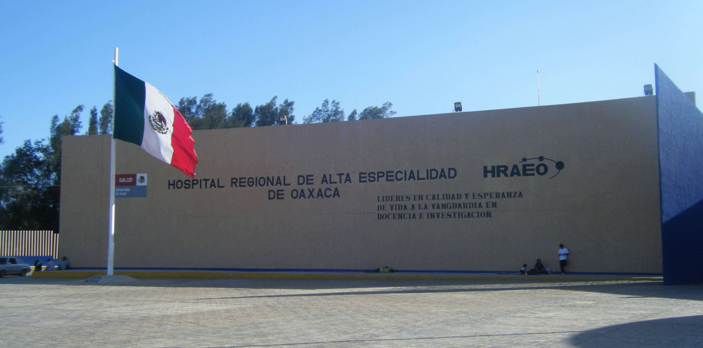
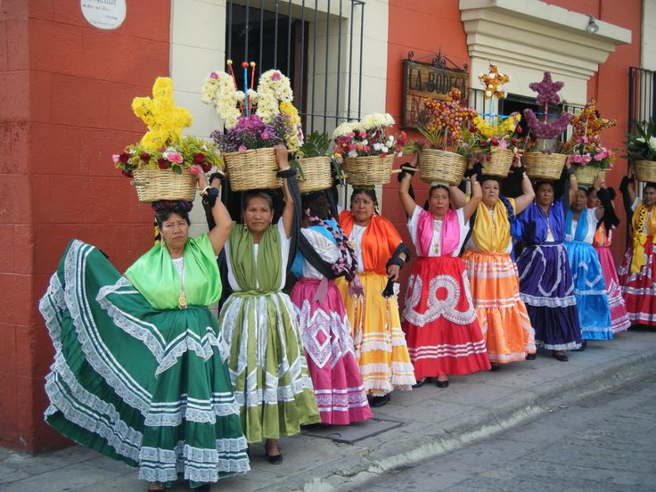

<figure class="alignleft">
	
</figure>

In Mexico, in order to complete the credit requirements of any undergraduate program, you are required (by law) to perform a so-called *social service*: 480 hours of non-remunerated work in a nonprofit organization (preferentially in your field). This time corresponds to a half-time service for one semester or a full-time service for one summer. The [Biomedical Engineering program at the Universidad Iberoamericana](https://ibero.mx/licenciaturas/licenciatura-en-ingenier-biom-dica){: target="_blank"} is no exception.

In my case, I decided for the latter option - summer of 2009. Not only did I chose it because it wouldn't interfere with my lectures, but this also allowed me doing my social service outside of Mexico City. At first, I thought of the social service as a requirement that I wanted to get done with as soon as possible. I thought I would get the feel of the field work of a Biomedical Engineer, learn one or two new things, and get the credits. I had no clue what kind of experience was before me.

<figure class="aligncenter">
	
  <figcaption>Main facade of Oaxaca’s HRAE.</figcaption>
</figure>

<!--more-->

I was given the opportunity to perform my social service at the [HRAE Oaxaca](http://www.hraeoaxaca.salud.gob.mx/){: target="_blank"}, in the state of Oaxaca. I was incorporated into the BME department of the hospital, under the supervision of Javier Soto-Garcia. He is not only a very competent Biomedical Engineer, but also a great person that took real concern in my stay and (learning) experience. Additionally, I was also very lucky to find myself in a very supportive team: Carmen, David, and *Toño* (morning shift), Marco and Armando (afternoon shift), and Juan Carlos, Herson, and *Conan* (from the neighboring Technical Support & Maintenance Department). Through the day, there was never a fixed schedule. However, the BME department was always busy with a wide range of activities.

One of the most common tasks was to perform preventive and corrective maintenance of medical equipment (only to that which was not covered by the manufacturer). This was very different from what I was taught at college, it was like seeing the other side of the coin: one thing is to know how medical equipment works (what is the physical principle underlying its operation) and another one is actually getting to know how to diagnose a broken piece of equipment and get it running again. I also had the opportunity to be present in different types of surgery, providing (basic) support to the medical staff. Although stressful at some point, for me it was pretty cool to be present in numerous surgeries - something I had been wanting to do for a long time. Furthermore, I also had the chance to provide technical training (i.e. training courses) for medical doctors and nurses, putting into practice my communication skills with an audience different to what I was used to.

However, I believe that the most valuable experience came not from the medical equipment, but from the people. The feeling of belonging to a dynamic work team where you are treated as an equal is amazing. Furthermore, with the social service I was able to feel and to perceive the real impact of BME in people's life. I could see with my own eyes how the development of technology can contribute to perform better diagnosis, provide more effective treatments, and in overall improve the life of a patient. Although it is a big responsibility, the rewarding feeling of doing such a job is even more.

As a bonus, I had the chance to live in one of Mexico's most beautiful states. It is a great place to visit with its *amazing* food, folklore, traditions, and warm people (I might even write a post about it in the future). If you have the chance, [don't miss the opportunity to visit Oaxaca](https://www.visitmexico.com/en/main-destinations/oaxaca/oaxaca){: target="_blank"}. You won't regret it.

<figure class="aligncenter">
	
  <figcaption>Oaxaca women with typical (colorful) dresses.</figcaption>
</figure>

All in all, my social service turned out to be an unforgettable experience at so many levels. It went beyond my expectations *by far*. Looking back, I realize how much it helped me grow not only as a professional but, most importantly, as a person. I am really grateful to all the people that made it possible.

----------
If you have any comments, questions or feedback, leave them in the comments below [or drop me a line on Twitter (@amoncadatorres)](http://www.twitter.com/amoncadatorres){: target="_blank"}. Moreover, if you found this useful, fun, or just want to show your appreciation, you can always [buy me a cookie](https://www.buymeacoffee.com/amoncadatorres){: target="_blank"}. Cheers!
