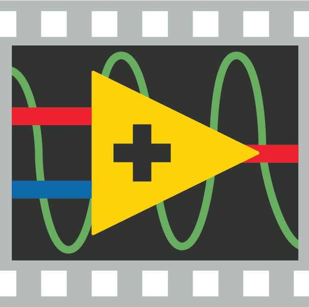
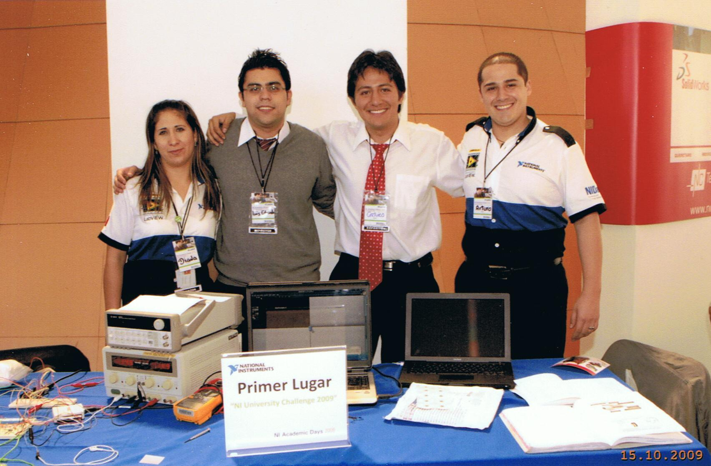

<figure class="alignleft">
	
</figure>

Last week, we obtained the First National Prize in the National Instruments University Challenge 2009 with the project *Home Control System for Handicapped People based on Electrooculography*. It was a very challenging but also very rewarding experience for all of us in the team: Luis E. Lara-Gonzalez, my colleague and friend, and Prof. Jorge A. Martínez-Alarcon, M. Sc., our professor and advisor.

<figure class="aligncenter">
	
  <figcaption>From left to right: Diana González-Ramírez (NI Marketing Coordinator), Luis E. Lara-González (colleague and friend), yours truly, and Arturo Vargas-Mercado (NI Academic Program Manager).</figcaption>
</figure>

<!--more-->

## Home Control System for Handicapped People based on Electrooculography

The challenge was to build a friendly and easy-to-use tool that would improve the quality of life of handicapped people that are unable to control basic aspects from their home environment.

We developed a computer system based on the action potentials generated by the ocular muscles (also know as electrooculography, EOG) that allows handicapped people to control the on and off switching of various home appliances in an easy and efficient way.

## Media Coverage

Some media liked the project so much that they were kind enough to let us talk to them about it. Below a few of them:

* **Grupo Efe (Spain)**  
Here is the interview we gave to Grupo Efe (English subtitles available in the captions).

<iframe width="560" height="315" src="https://www.youtube.com/embed/txkMLl26hKo" frameborder="0" allow="accelerometer; autoplay; encrypted-media; gyroscope; picture-in-picture" allowfullscreen></iframe>

* **RCN Radio (Colombia)**  
You can listen to the interview we gave to the RCN Radio program “Domingo RCN” from Colombia (sorry, Spanish only).

<iframe width="100%" height="200" scrolling="no" frameborder="no" allow="autoplay" src="https://w.soundcloud.com/player/?url=https%3A//api.soundcloud.com/tracks/713921971&color=%23ff5500&auto_play=false&hide_related=false&show_comments=true&show_user=true&show_reposts=false&show_teaser=true&visual=true"></iframe>

Furthermore, written and online platforms wrote a few pieces about the project:
* [Comunidad Ibero](../pdfs/ni2009_uia.pdf){: target="_blank"} (Universidad Iberoamericana's publication)
* [Barrio](../pdfs/ni2009_barrio.pdf){: target="_blank"} (magazine)
* [Cronica](../pdfs/ni2009_cronica.pdf){: target="_blank"} (newspaper)

----------
If you have any comments, questions or feedback, leave them in the comments below [or drop me a line on Twitter (@amoncadatorres)](http://www.twitter.com/amoncadatorres){: target="_blank"}. Moreover, if you found this useful, fun, or just want to show your appreciation, you can always [buy me a cookie](https://www.buymeacoffee.com/amoncadatorres){: target="_blank"}. Cheers!
