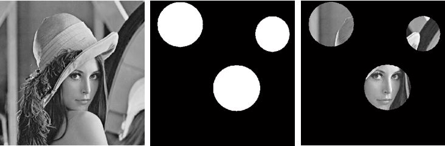

<figure class="alignleft">
	
</figure>

When working with images, selecting a specific region of an image to work with is quite common. Therefore I made a script that allows you to generate a mask with one or more regions of interest (ROIs). The shape of the ROIs can be rectangular, elliptic, (irregular) polygon, or free-hand drawn.

<figure class="aligncenter">
	
  <figcaption>Original Lena, generated mask, and masked Lena.</figcaption>
</figure>

<!--more-->

You can find the scripts in my [Github repository](https://github.com/arturomoncadatorres/generating-binary-mask){: target="_blank"}, which includes the classic image of Lena to use it in the demo. I suggest play with it in order to understand how it works. The scripts include plenty of comments in which I tried to explain each of the steps as clear as possible. If you still have questions about the implementation or, even better, suggestions for its improvement, please leave a comment here or [file a new issue in Github](https://github.com/arturomoncadatorres/generating-binary-mask/issues){: target="_blank"}.
