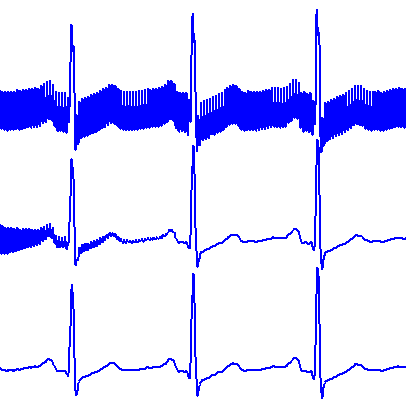

<figure class="alignleft">
	
</figure>
<figure class="alignleft">
	
</figure>

Recently, I was going through my undergraduate lecture notes. I stumbled upon an exercise which I found interesting. The task consisted in implementing the algorithm proposed by Pei and Tseng, which uses vector projection to minimize the problem of transient values when applying an IIR notch filter to an ECG signal.

<figure class="aligncenter">
	
  <figcaption>Top: original ECG signal with AC interference noise. Middle: filtered ECG signal using a typical IIR notch filter. Bottom: filtered ECG signal using an IIR notch filter with the proposed transient suppression technique.</figcaption>
</figure>

<!--more-->

A complete, detailed explanation of it can be found in

> Pei, Soo-Chang, and Tseng, Chien-Cheng. ["Elimination of AC interference in electrocardiogram using IIR notch filter with transient suppression"](http://ieeexplore.ieee.org/xpl/articleDetails.jsp?tp=&arnumber=469385){: target="_blank"}. Biomedical Engineering, IEEE Transactions on 42.11 (1995): 1128-1132.

Full credit goes to the authors.

I decided to implement it in MATLAB and in Python. You can find the submission in my [Github repository](https://github.com/arturomoncadatorres/ecg-transient-suppression){: target="_blank"}, which includes sample ECG data (as a `.mat` file) as well as a main/demo file, which I suggest you to try in order to understand how it works. The scripts include plenty of comments in which I tried to explain each of the steps as clear as possible. If you still have questions about the implementation or, even better, suggestions for its improvement, please leave a comment here or [file a new issue in Github](https://github.com/arturomoncadatorres/ecg-transient-suppression/issues){: target="_blank"}.
