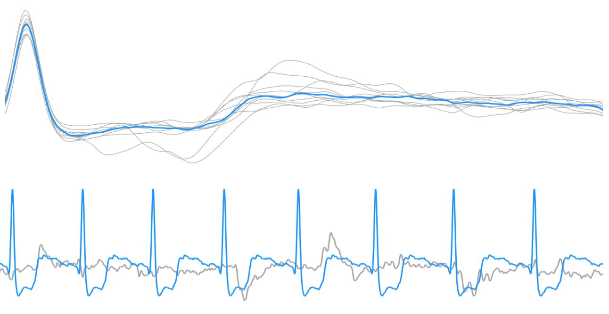

<figure class="alignleft">
	
</figure>
<figure class="alignleft">
	
</figure>

For some strange reason, I stumbled with a paper that I had downloaded long time ago. It explains a simple algorithm for removing artifacts in ECG signal. Since I have a short time-off after the submission of my PhD thesis (yey!), I thought it would be cool to actually code the algorithm and give it a go.

<figure class="aligncenter">
	
  <figcaption>Top: median cardiac cycle. Bottom: clean ECG signal in blue; (removed) motion artifact in gray.</figcaption>
</figure>

<!--more-->

A complete, detailed explanation of it can be found in

> Agostinelli, Angela, Corrado Giuliani, and Laura Burattini. ["Extracting a clean ECG from a noisy recording: a new method based on segmented-beat modulation"](https://ieeexplore.ieee.org/abstract/document/7042976){: target="_blank"}. Computing in Cardiology Conference (CinC), 2014. IEEE, 2014.

Full credit goes to the authors.

You can find the submission in my [Github repository](https://github.com/arturomoncadatorres/ecg-segmented-beat-modulation-noise-removal){: target="_blank"}, which includes sample ECG data (as a `.mat` file) as well as a main/demo file, which I suggest you to try in order to understand how it works. The scripts include plenty of comments in which I tried to explain each of the steps as clear as possible. If you still have questions about the implementation or, even better, suggestions for its improvement, please leave a comment here or [file a new issue in Github](https://github.com/arturomoncadatorres/ecg-segmented-beat-modulation-noise-removal/issues){: target="_blank"}.
