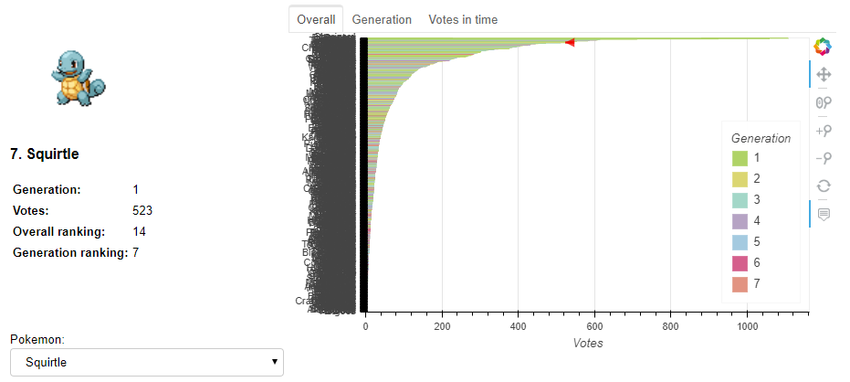

<figure class="alignleft">
	
</figure>
<figure class="alignleft">
	
</figure>

Previously, I looked into [Pok&eacute;mon's popularity from all 7 generations](https://github.com/arturomoncadatorres/favorite-pokemon){: target="_blank"}. However, I felt the visualizations were a bit static. Furthermore, you couldn't get details on your preferred Pok&eacute;mon. Therefore, I decided to extend this project and created an interactive dashboard using [Bokeh](https://bokeh.pydata.org/en/latest/index.html){: target="_blank"} and [Binder](https://mybinder.org/){: target="_blank"} to visualize the results of the survey. It allows you to choose whatever Pok&eacute;mon you want and see its preference ranking compared to all Pok&eacute;mon, compared to all Pok&eacute;on of its generation, and how did people voted for it in time during the period in which the survey was open (notice how the color of that plot corresponds to the Pok&eacute;mon's dominant color)

<!--more-->

* **Find the [complete Github repository here](https://github.com/arturomoncadatorres/favorite-pokemon-interactive){: target="_blank"}**
* **Find the [interactive visualization here](https://mybinder.org/v2/gh/arturomoncadatorres/favorite-pokemon-interactive/16eebda4779dd6dc52fcdc4c2181b291fbb5a270?urlpath=%2Fproxy%2F5006%2Fbokeh-app)** 
 (be patient, it can take a while to load; works best on desktop).

A big shout out to [@bryevdv](https://github.com/bryevdv) for helping me with a [few issues I had with Bokeh legends](https://discourse.bokeh.org/t/cant-order-legend-entries-in-hbar-plot/3816) and to [@betatim](https://github.com/betatim) and [@jdkent](https://github.com/jdkent) for [helping me deploying the Bokeh app in Binder](https://discourse.jupyter.org/t/creating-a-shareable-bokeh-dashboard-with-binder/1962). The latter isn't so trivial. Thus I wrote a small post with the required steps to do so, which [you can find here](http://www.arturomoncadatorres.com/creating-a-shareable-bokeh-dashboard-with-binder/).
