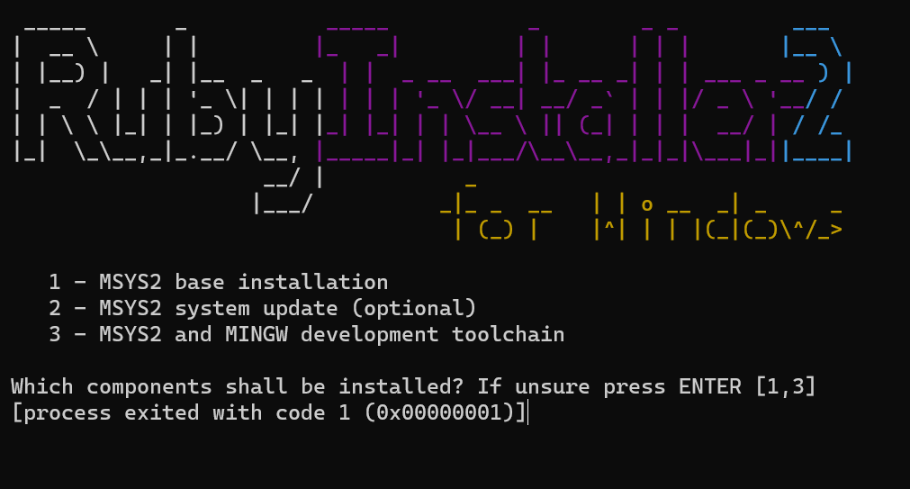

<figure class="alignleft">
	
</figure>
<figure class="alignleft">
	
</figure>

Recently, I decided to move my website from Wordpress to a [Jekyll](https://jekyllrb.com/){: target="_blank"} and [GitHub Pages](https://pages.github.com/){: target="_blank"}. As you can see, my website is quite simple: a few posts and a couple of fixed pages. Jekyll and GitHub Pages make a very good job in accommodating my needs.

<figure class="aligncenter">
	
</figure>

However, it can be a bit tricky setting up everything. In this post I would like to share a quick guide on how to set everything up.

<!--more-->

## Installation
1. As mentioned in the official [Jekyll documentation](https://jekyllrb.com/docs/installation/windows/){: target="_blank"}, first install a `Ruby+Devkit` version from [RubyInstaller Downloads](https://rubyinstaller.org/downloads/){: target="_blank"}. Use the default options for installation. Make sure that `MSYS2` and `MINGW` are installed as well (see [Tips, Tricks, and Troubleshooting](https://arturomoncadatorres.com/creating-updating-website-hosted-github-pages-using-jekyll/#tips-tricks-and-troubleshooting) if they don't)
1. Open a new command prompt (in admin mode) and install Jekyll and Bundler using `gem install jekyll bundler`
1. Check if Jekyll was installed properly using `jekyll -v`. You should see as an output something like `jekyll 4.0.0`
1. Perform a bundle update typing `bundle update`
1. Navigate to the directory where your website files will be located (e.g., `C:\Users\website\`) and install GitHub Pages typing `gem install github-pages`
*or*
copy and paste the files from a template.
0. The `Gemfile` should have the following content

```
gem "github-pages", group: :jekyll_plugins

# Plugins go here.
group :jekyll_plugins do
    gem "jekyll-paginate", "~> 1.1.0"
    gem 'wdm', '>= 0.1.0'
end
```
If you are using a template, you might have to adjust them appropriately. For instance, the `Gemfile` of the template I used looks like this:

```
source "https://rubygems.org"
ruby RUBY_VERSION

# Hello! This is where you manage which Jekyll version is used to run.
# When you want to use a different version, change it below, save the
# file and run `bundle install`. Run Jekyll with `bundle exec`, like so:
#
#     bundle exec jekyll serve
#
# This will help ensure the proper Jekyll version is running.
# Happy Jekylling!
#gem "jekyll", "4.0.0"

# If you want to use GitHub Pages, remove the "gem "jekyll"" above and
# uncomment the line below. To upgrade, run `bundle update github-pages`
# (or `gem update github-pages` if you used a gem instead of a bundle).
gem "github-pages", group: :jekyll_plugins

# If you have any plugins, put them here!
group :jekyll_plugins do
    gem "jekyll-paginate", "~> 1.1.0"
    gem 'wdm', '>= 0.1.0'
end
```
Notice that since I am using GitHub Pages, I commented the line `gem "jekyll", "4.0.0"` and uncommented the line `gem "github-pages", group: :jekyll_plugins`.


## Adding/updating content

1. Navigate to the directory where your website files are located (e.g., `C:\Users\website\`)

**Locally**

2. Type `bundle exec jekyll serve`. This will launch a local server at `http://localhost:4000/`. Here, you will see the changes that you make to the website (locally).

**Online**

3. If you are happy with the changes, just push them to GitHub
- `git add ...`
- `git commit -m "Commit message"`
- `git push -u origin master`


## Setting up a computer for updating an existing website
1. As mentioned in the official [Jekyll documentation](https://jekyllrb.com/docs/installation/windows/){: target="_blank"}, first install a Ruby+Devkit version from [RubyInstaller Downloads](https://rubyinstaller.org/downloads/){: target="_blank"}. Use the default options for installation.
0. Open a new command prompt (in admin mode) and install Jekyll and Bundler using `gem install jekyll bundler`
0. Check if Jekyll was installed properly using `jekyll -v`. You should see as an output something like `jekyll 4.0.0`
0. Install the bundler using `gem install bundler` and `bundler install`

## Tips, tricks, and troubleshooting
- The `_site` files are in  the `.gitignore` because they are generated every time that the site is updated. Once in GitHub Pages, these files are generated based on the web content. There is really no need to push them at all.
- To change the code (color) theme:
  - Go to this gallery of [CSS themes for the Pygments syntax highlighter used by Jekyll](https://jwarby.github.io/jekyll-pygments-themes/languages/python.html){: target="_blank"} (by `jwarby`)
  - Choose a theme
  - Got to `assets/partials/_syntax.scss` and replace the content with that of the chosen theme
  - Additionally, add the line `.highlight {background: #fff; border: 1px solid $grey-color-lightest; padding: 15px;}` at the beginning to keep the box
  - If you get the error
    ```
    SyntaxError: /Users/taylor/Projects/personal_website/_plugins/generate_categories.rb:50: else without rescue is useless ...L = ”” if (BASEURL == nil) else BASEURL end ... ^~
    ```

    Go to `_plugins/generate_categories.rb` and change the line
    ```
    BASEURL = "" if (BASEURL == nil) else BASEURL end
    ```

    to
    ```
    if (BASEURL == nil)
      BASEURL = ""
    else
      BASEURL = BASEURL
    end
    ```

- If `MSYS2` or `MINGW` are not installing properly as part of the base installation
  When installing `Ruby+Devkit`, you should also install `MSYS2` or `MINGW` in order to be able to compile `Ruby` extensions. However, I've experienced that some times the installer gets stuck and you see something like this:

  <figure class="aligncenter">
  	
  </figure>

  You are supposed to choose option `3`, but the terminal crashes and you can't choose anything at all. In that case, you need to install things manually. To do so, follow the [official instructions](https://www.msys2.org/){: target="_blank"}. In short:
  1. [Download the installer](https://github.com/msys2/msys2-installer/releases/download/2022-05-03/msys2-x86_64-20220503.exe){: target="_blank"} and run it
  1. During the installation process, you will be asked for the desired installation folder. It is recommended that you stick with the original. If you want a different location, make sure that it a short ASCII-only path on a NTFS volume, that it has no accents, no spaces, no symlinks, and that it is no subst or network drives, no FAT.
  1. At the end of the installation, make sure to run `MSYS2` now. This will open an `MSYS2`s terminal.
  1. Update the package database and base packages by running in said terminal
  `pacman -Syu`
  1. This will close the `MSYS2` terminal when it is done. Opening it again by running
  `MSYS2 MSYS`
  from the Start menu (in a Windows machine) and run once again
  `pacman -Syu`
  1. Lastly, you need to install some additional tools and `mingw-w64 GCC` to start compiling. You can do so by running
  `pacman -S --needed base-devel mingw-w64-x86_64-toolchain`

### Additional resources
Please note that this quick guide is by no means meant to be exhaustive. If you want to know learn more about the involved components, take a look at these additional resources:

- [Working with GitHub Pages](https://help.github.com/en/github/working-with-github-pages){: target="_blank"} (official documentation)
- [How do I order pages in the side bar?](https://stackoverflow.com/a/33983971/948768){: target="_blank"}
- [How can I add Jekyll Tags using GitHub Pages?](https://longqian.me/2017/02/09/github-jekyll-tag/){: target="_blank"}
- [How can I add Jekyll Tags using GitHub Pages automatically?](https://arturomoncadatorres.com/automatically-generating-tag-posts-for-github-pages-using-jekyll/){: target="_blank"}
- [Updating dependencies for GitHub Pages using Jekyll](https://arturomoncadatorres.com//update-dependencies-jekyll-based-github-pages-site){: target="_blank"}
- [Installing MSYS2](https://www.msys2.org/){: target="_blank"} (official documentation)

----------
If you have any comments, questions or feedback, leave them in the comments below [or drop me a line on Twitter (@amoncadatorres)](http://www.twitter.com/amoncadatorres){: target="_blank"}. Moreover, if you found this useful, fun, or just want to show your appreciation, you can always [buy me a cookie](https://www.buymeacoffee.com/amoncadatorres){: target="_blank"}. Cheers!
