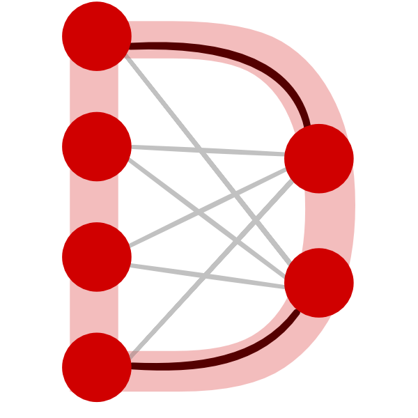

<figure class="alignleft">
	
</figure>
<figure class="alignleft">
	
</figure>

Today, the version 0.2.0 of DeepSurvK is released!

<!--more-->

The new features and changes include:

* Improved parameter definition (from function arguments to dictionary)
* Added basic parameter optimization (grid search), including example notebook
* Bug fixes

For a full list of changes, see the [release notes](https://github.com/arturomoncadatorres/deepsurvk/blob/master/HISTORY){: target="_blank"}.

I hope to keep working and improving DeepSurvK in the future!

-------------

DeepSurvK was developed in [Spyder](https://www.spyder-ide.org/){: target="_blank"} (a fantastic open-source Python IDE) using [Cookiecutter](https://github.com/cookiecutter/cookiecutter){: target="_blank"} and the [`arturomoncadatorres/cookiecutter-pypackage` project template](https://github.com/arturomoncadatorres/cookiecutter-pypackage){: target="_blank"}.

If you have any questions, comments, or feedback, please [open a discussion](https://github.com/arturomoncadatorres/deepsurvk/discussions). If there is a problem with the code (e.g., mistake), please [open an issue](https://github.com/arturomoncadatorres/deepsurvk/issues). You can always drop me a line on Twitter [(@amoncadatorres)](https://twitter.com/amoncadatorres). Lastly, if you found this useful, fun, or just want to show your appreciation, you can always [buy me a cookie](https://www.buymeacoffee.com/amoncadatorres){: target="_blank"}. Cheers!
