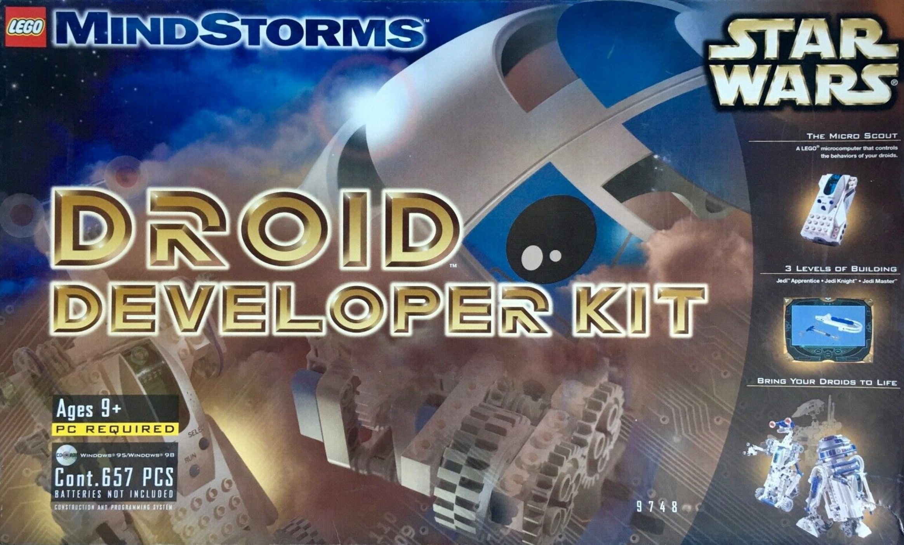
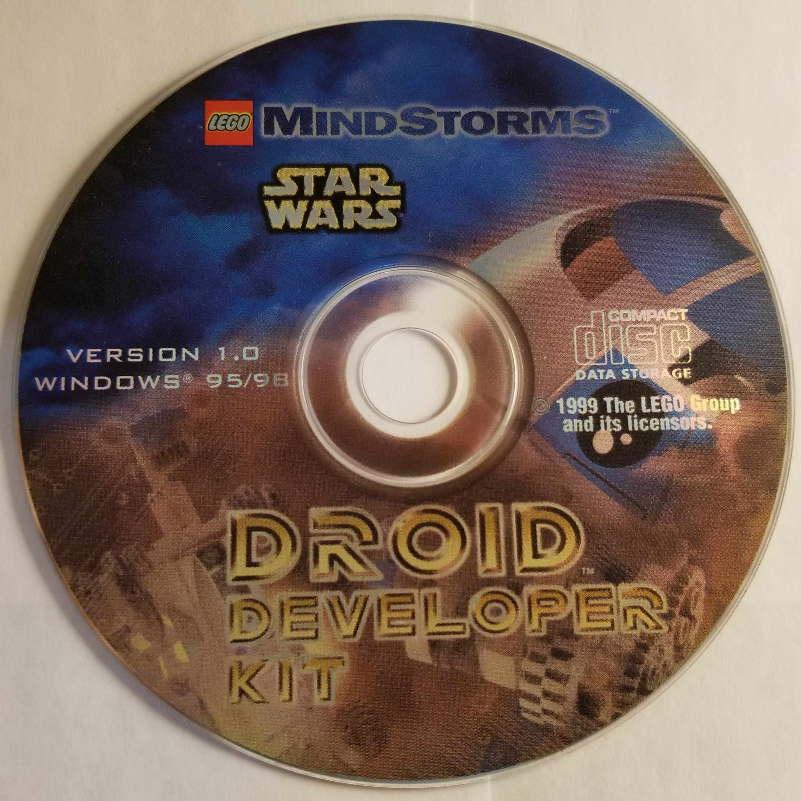
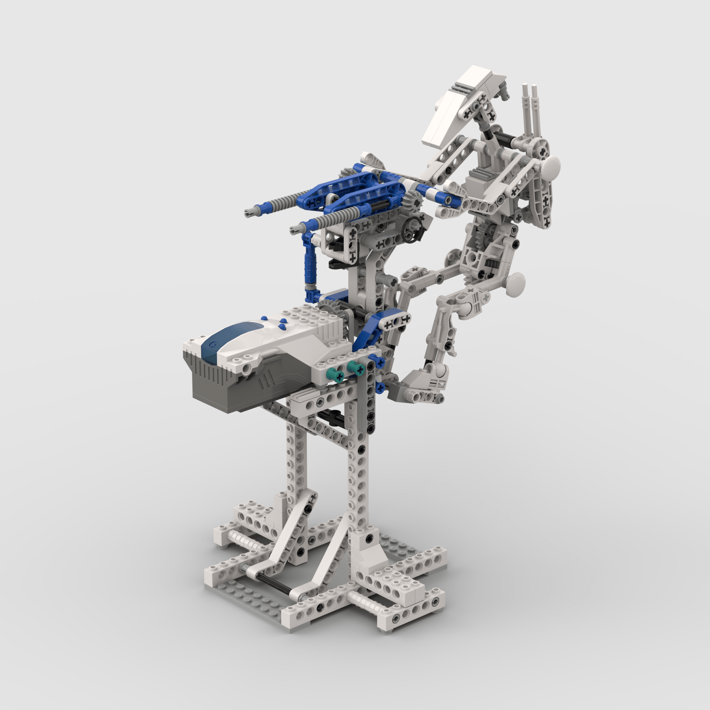
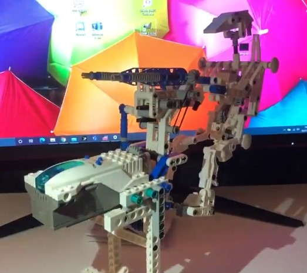

<figure class="alignleft">
	
</figure>
<figure class="alignleft">
	
</figure>

As a teenager (and even during my years at college), I had a blast playing with the LEGO Mindstorms sets. One of them ones was the [Droid Developer Kit (9748)](https://legostarwars.fandom.com/wiki/9748_Droid_Developer_Kit){: target="_blank"}. Basically, it allowed you to build Star Wars droids and put them in action using the included Micro Scout (which included a motor, a light sensor, and seven built-in programs). I still have my original kit and with the Star Wars fever caused by The Mandalorian (and [all the announced shows coming in the near future](https://www.ign.com/articles/disney-investor-day-2020-every-announcement-movies-tv-trailers-reveals-news){: target="_blank"}), I thought this Christmas break was the perfect occasion to jump back into this set.

  

<!--more-->

The original kit had an instruction booklet that allowed you to build three different models: a trainer droid, R2D2 (of course), and a Jedi Knight Droid (basically a car). While it is hard to come up with a physical copy of the booklet, it isn't hard to find [digital versions](https://www.manualslib.com/manual/978351/Lego-Star-Wars-9748.html){: target="_blank"} [of it](https://www.touteslesbriques.org/images/instructions/9748-instruction-1-13652.pdf){: target="_blank"}.

More interestingly, the kit also included a CD, which had instructions for additional (more complex) models, such as a crane, an opee sea creature, a Gungan submarine, and a [battle droid on STAP](https://starwars.fandom.com/wiki/Single_Trooper_Aerial_Platform){: target="_blank"}. I wanted to build the latter. Unfortunately, CD copies are hard to find and apparently impossible to run in modern Windows versions (plus who has a CD drive in their computers nowadays, anyway?).

   
  Image from the Internet Archive

Thus, I took the project of back-engineering the construction of the model. To do so, I looked for pictures and video of it, which to my dismay weren't that many. Nevertheless, based on [a couple](https://www.youtube.com/watch?v=dk1Mgv8NKcU&){: target="_blank"} of [YouTube videos](https://www.youtube.com/watch?v=35EPBXa7NPU&ab_channel=jimlewis){: target="_blank"} and a few pictures on [old websites](http://www.wd5gnr.com/droid.htm){: target="_blank"}, I finally managed to recreate it. I'd say it looks quite on spot with the original.

  

I thought it was a real pity that no instructions existed for this cool model. Thus, I wanted to generate them based on my experience, so other builders could also have the chance to play with it. After weighting several options, I decided to use [Bricklink Studio](https://www.bricklink.com/v3/studio/download.page){: target="_blank"}. I was amazed by how easy it is to use, even if you don't have experience using CAD software. Besides allowing you to create virtual models, you can also generate their instructions practically in an identical style as an original LEGO booklet. See for yourself:

 

  

 

Moreover, you can also produce renders of your creations, which look astonishing (the image above is actually a render - I would never be able to take such a photograph).

I estimate that the whole thing (i.e., building the original model, generating the instructions, and producing the renders) probably took me around 45 h. I had tons of fun working on this project and I hope that I can use this model as a base for future creations!

## Gallery
If you build this model, please share some pictures! I'd love to add them here.

  <table><tr>
  <td>  </td>
  </tr>
  <tr>
  <td> By <a href="https://twitter.com/maxpayneonpoli1/status/1347636199586934784?s=20">@maxpayneonpoli1</a> </td>
  </tr>
  </table>

----------
If you have any comments, questions or feedback, leave them in the comments below [or drop me a line on Twitter (@amoncadatorres)](http://www.twitter.com/amoncadatorres){: target="_blank"}. Moreover, if you found this useful, fun, or just want to show your appreciation, you can always [buy me a cookie](https://www.buymeacoffee.com/amoncadatorres){: target="_blank"}. Cheers!
