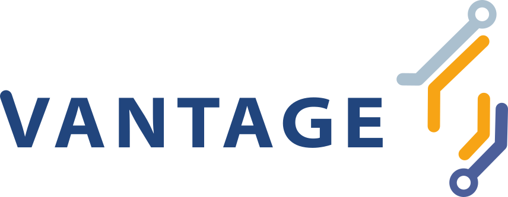
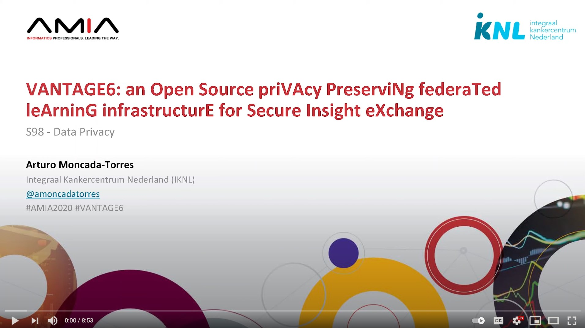

<figure class="alignleft">
	
</figure>

Answering many of the questions in the field of cancer informatics (and in health care in general), often requires researchers to incorporate data from different sources. Typically, this is done by centralizing the data. In other words, data are brought to the where the algorithms are. Unfortunately, this brings several organizational, operational, political, and ethical challenges, such as loss of data control, logistics of data transmission, data governance, and protection of patient privacy.

Federated learning has emerged as a technology with the potential to overcome these limitations. In this case, we flip things around and we bring the algorithms to where the data are. For this purpose, at IKNL we have developed our open-source priVAcy preserviNg federaTed leArninG infrastructurE for Secure Insight eXchange – or VANTAGE6 for short.

  

<!--more-->

We wrote a paper where we describe the niche that VANTAGE6 fills in the federated learning landscape, its conceptual design, and its architecture. You can find the paper [here](https://vantage6.ai/documents/7/moncada-torres2020vantage6_57GU4Gt.pdf){: target="_blank"}.

Moreover, this work was presented as a contribution during the [AMIA 2020 Virtual Annual Symposium](https://www.amia.org/amia2020){: target="_blank"}. It was accompanied by an oral presentation, which you can watch on YouTube as well (~9 min, in English):

{: target="_blank"}

----------
If you want to know more about VANTAGE6, check [its website](https://vantage6.ai/){: target="_blank"} or follow me on [Twitter (@amoncadatorres)](http://www.twitter.com/amoncadatorres){: target="_blank"} for more updates.
