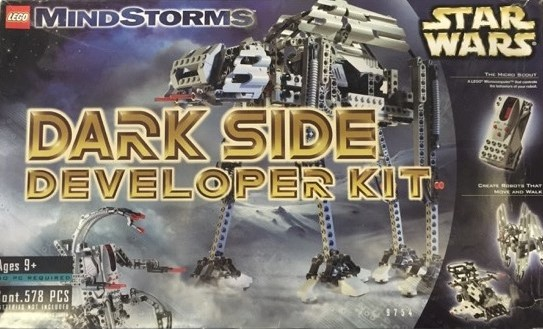
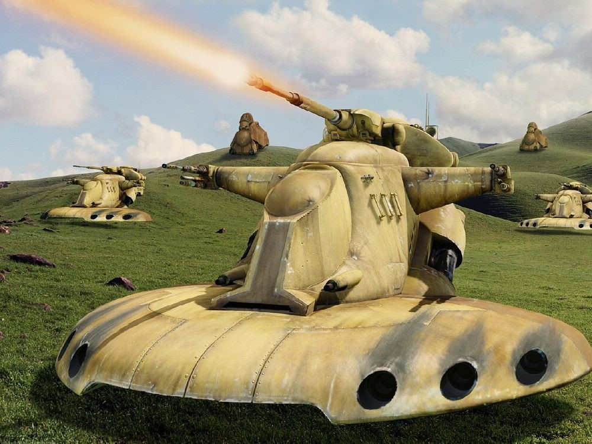

<figure class="alignleft">
	
</figure>
<figure class="alignleft">
	
</figure>

I had a complete blast (re)building the [Battle Droid on STAP](https://arturomoncadatorres.com/battle-droid-stap/) from the Droid Developer Kit (9748). Thus, the next natural step was to give a model of the Dark Side Developer Kit (9754) the same treatment.

  

<!--more-->

The original set came with three different booklets ([1](https://www.lego.com/cdn/product-assets/product.bi.core.pdf/4133367.pdf){: target="_blank"}, [2](https://www.lego.com/cdn/product-assets/product.bi.core.pdf/4133368.pdf){: target="_blank"}, [3](https://www.lego.com/cdn/product-assets/product.bi.core.pdf/4133369.pdf){: target="_blank"}) with instructions to build a Droid Starfighter, a Destroyer Droid (aka Droideka), and an AT-AT. However, in contrast to the Droid Developer Kit, this set didn't have a CD. Instead, the booklets had pictures of the alternative builds. Among these, you could find the [Armored Assault Tank](https://starwars.fandom.com/wiki/Armored_Assault_Tank){: target="_blank"} (or AAT for short).

  

I always liked this tank. I think it looked amazing, especially in Episode I's Battle of Naboo. Thus, I was very excited to back-engineer the construction of this model. Fortunately, the booklet contained quite a few images, making the recreation a bit easier than the one of the Battle Droid STAP was.

  

I find the design of the build very interesting and clever: with only one motor, the AAT can move and make the turret look for a target.

Overall, I am very happy with the results. I wanted other people could enjoy building this model as much as I did. Thus, I also generated the instructions using [Bricklink Studio](https://www.bricklink.com/v3/studio/download.page){: target="_blank"}.

 

  

 

This time, I estimate that the whole thing (i.e., building the original model, generating the instructions, and producing the renders) probably took me around 30 h. I had tons of fun working on this project and I hope that I can use this model as a base for future creations!

## Gallery
If you build this model, please share some pictures! I'd love to add them here.

----------
If you have any comments, questions or feedback, leave them in the comments below [or drop me a line on Twitter (@amoncadatorres)](http://www.twitter.com/amoncadatorres){: target="_blank"}. Moreover, if you found this useful, fun, or just want to show your appreciation, you can always [buy me a cookie](https://www.buymeacoffee.com/amoncadatorres){: target="_blank"}. Cheers!
