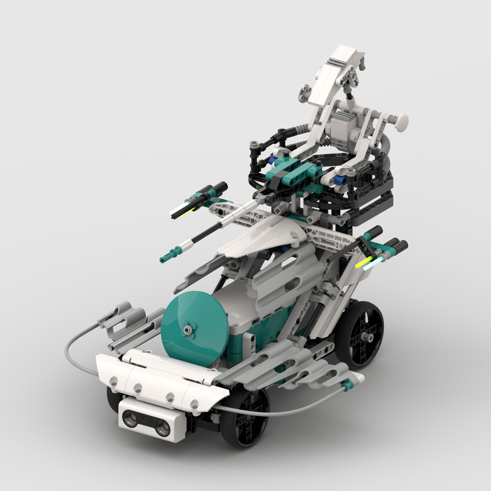
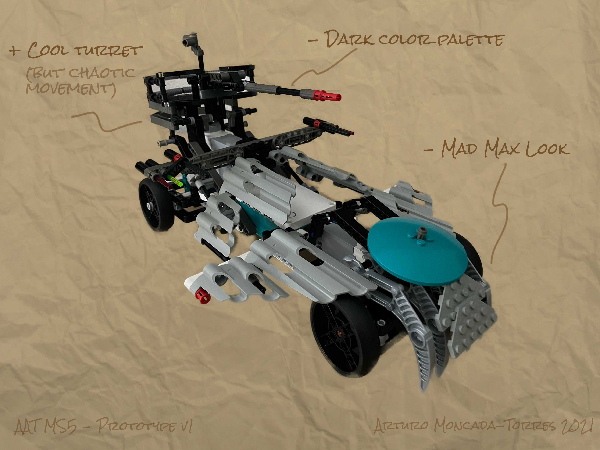
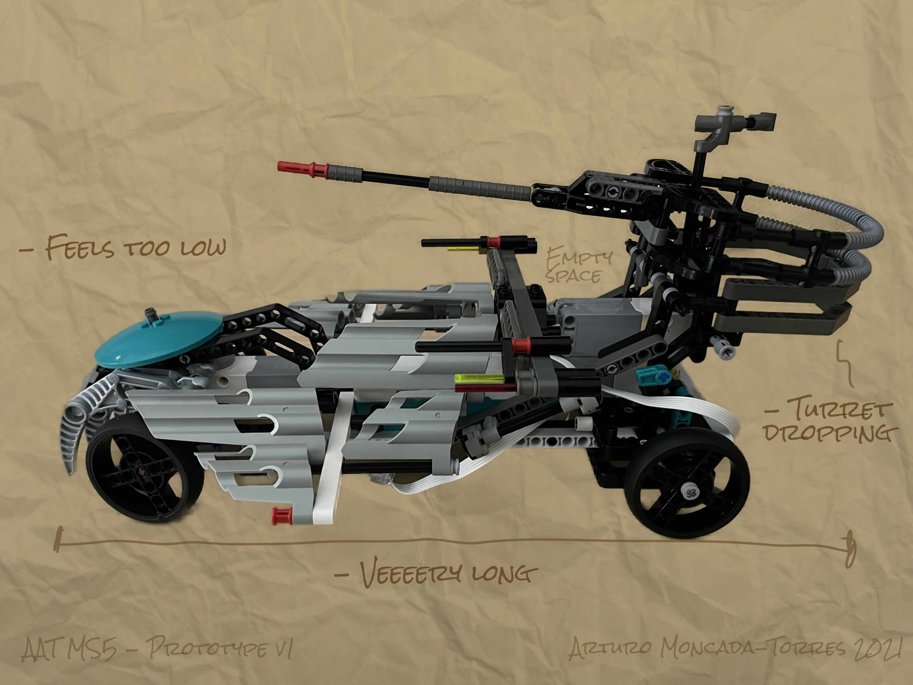
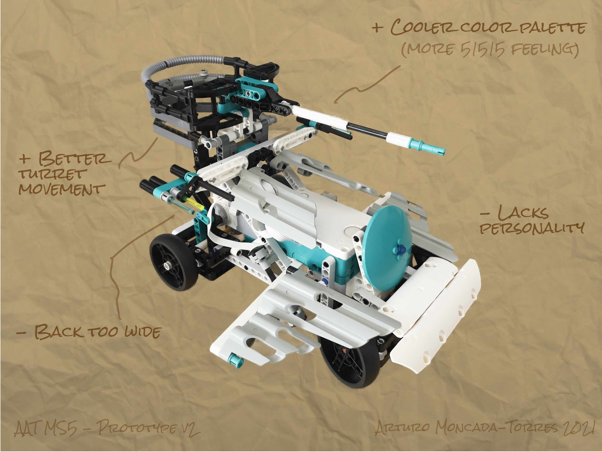
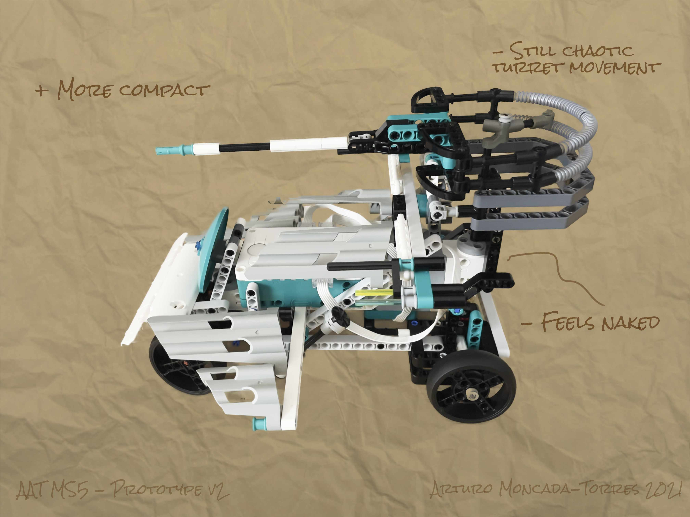
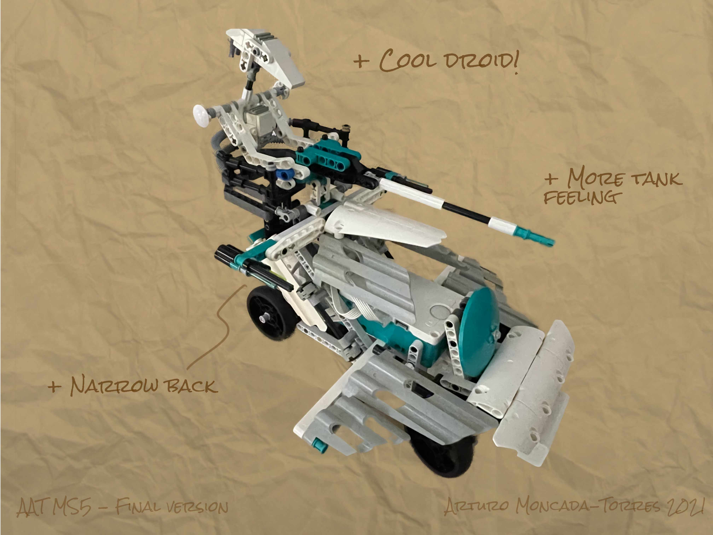
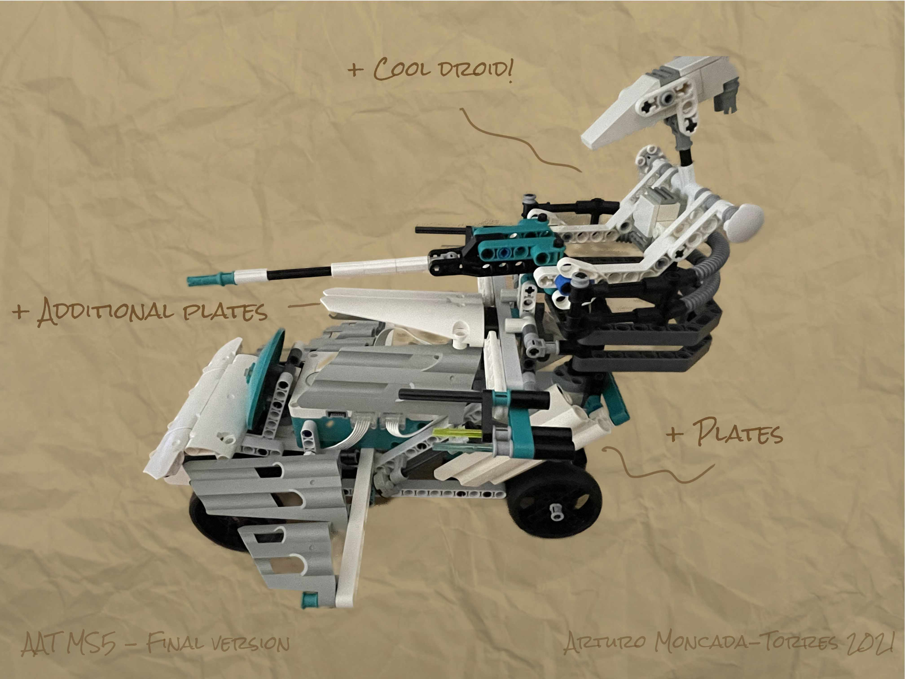

<figure class="alignleft">
	
</figure>
<figure class="alignleft">
	
</figure>

In this project, I built an Armored Assault Tank using the MINDSTORMS 51515 set, or **AAT MS5** in short. It is inspired by the [Battle Droid on STAP](https://arturomoncadatorres.com/battle-droid-stap/){: target="_blank"} of the Droid Developer Kit and the [AAT](https://arturomoncadatorres.com/aat/){: target="_blank"} of the Dark Side Developer Kit. Moreover, it is powered by the [MINDSTORMS Robot Inventor set 51515](https://www.lego.com/en-nl/product/robot-inventor-51515){: target="_blank"} and programmed using Python.

  

<!--more-->

----------

  <a href="#design-process">Design Process</a> •
  <a href="#instructions">Instructions</a> •
  <a href="#program">Program</a> •
  <a href="#showcase">Showcase</a>  •
  <a href="#gallery">Gallery</a>

----------

## Design Process
The design process of the AAT MS5 consisted of three different iterations:

#### Version 1

  <table><tr>
  <td>  </td>
  <td>  </td>
  </tr>
  </table>

This was my first attempt. It drew heavily from the original AAT build. I particularly liked the turret, although the actual movement was quite chaotic. The color palette was very dark and not really representative of the 51515 set. I was also unhappy with the proportions: it was very long and quite short, which didn't make it look like a tank at all, but more like a weird Batmobile. Moreover, the design of the front part looked straight out of a Mad Max movie.

#### Version 2

  <table><tr>
  <td>  </td>
  <td>  </td>
  </tr>
  </table>

In the next iteration, I tried to fix some of the shortcomings of the previous version. First, I replaced many of the parts to make the AAT MS5 look more as a 51515 set. I shuffled the elements to make the tank shorter and a little bit higher, making it more compact. However, the back of the tank still was quite wide, which still made it look more like a car rather than a tank. I revamped and raised the turret, but its movement was still a bit chaotic. Unfortunately, its base still seemed a bit naked, showing the motor. Lastly, I felt it was still "just a tank". I wanted it to stand out and make it look cooler.

#### Version 3 (Final)

  <table><tr>
  <td>  </td>
  <td>  </td>
  </tr>
  </table>

This is the final version. I fined tuned the small things that were still bothering me. For instance, I used additional plates to cover the motor of the turret and on top of the hub, to give the AAT MS5 a more cohesive appearance. I also reduced the dimensions of the back wheels, making them more discrete, especially when seen from the front. More importantly (and notoriously), I added the pilot droid! Instead of connecting the motor to the turret directly, I connected the motor to the droid and made the droid hold the turret. Not only is this a bit more realistic, but it made the movement much more stable. I decided I would control the sweeping of the turret in the program (see below).

## Instructions

I generated the instructions using [Bricklink Studio](https://www.bricklink.com/v3/studio/download.page){: target="_blank"}. You can find them here:

 

  

 

The instructions also include a bill of materials, in case you decide to build the AAT MS5 yourself. You can also find the inventory on its corresponding [Rebrickable page](https://rebrickable.com/mocs/MOC-66780/arturomoncadatorres/aat-ms5/#parts){: target="_blank"}.

## Program

Upon starting the hub, the AAT MS5 calibrates its motors and starts going around in a circle. At the same time, the droid sweeps the turret from left to right and from right to left while searching for rebels. When it finds one (i.e., when the distance sensor detects an obstacle), the AAT MS5 stops, points the blaster to the center and fires!

I programmed the robot using Python. You can find the script (as part of my GitHub repository) here.

 

  

 

To use it, just copy and paste the content of the script in a new MINDSTORMS Python project and you will be good to go. If you want to get a more visually pleasant version of the code that is easier to read and understand, I recommend checking [its corresponding notebook here](https://nbviewer.jupyter.org/github/arturomoncadatorres/lego-mindstorms/blob/main/mocs/aat_ms5/programs/aat_ms5.ipynb?flush_cache=True){: target="_blank"}. If you are curious, you can read more about [my programming setup here](https://github.com/arturomoncadatorres/lego-mindstorms#my-programming-setup){: target="_blank"}.

Moving the AAT MS5 was quite straightforward. However, the biggest challenge was to make the turret move independently of the wheels and steering motors. This was especially complicated because I wanted the turret to react relatively fast upon detecting an obstacle (and not having to wait until a whole sweeping cycle was completed). I solved this by using co-routines.

The idea of using co-routines was originally proposed by [David Lencher](https://community.legoeducation.com/discuss/viewtopic/66/110){: target="_blank"}. Actually, I've used this principle before as part of [Charlie's `drum_solo` project](https://github.com/arturomoncadatorres/lego-mindstorms/tree/main/base/charlie){: target="_blank"}. However, in the case of the AAT MS5, the movement depends on the position of a motor (and not on time), making it a bit simpler. For a complete explanation of how it works, take a look at the script's corresponding [Jupyter notebook](https://nbviewer.jupyter.org/github/arturomoncadatorres/lego-mindstorms/blob/main/mocs/aat_ms5/programs/aat_ms5.ipynb?flush_cache=True){: target="_blank"}.

## Showcase

The best part: seeing the whole thing in action!

  

## Gallery
If you build this model, please share some pictures! I'd love to add them here.

----------
If you have any questions, comments, or feedback, please [open a discussion](https://github.com/arturomoncadatorres/lego-mindstorms/discussions). If there is a problem with the code (e.g., mistake), please [open an issue](https://github.com/arturomoncadatorres/lego-mindstorms/issues). Moreover, you can always drop me a line on Twitter [(@amoncadatorres)](https://twitter.com/amoncadatorres). Lastly, if you found this useful, fun, or just want to show your appreciation, you can always [buy me a cookie](https://www.buymeacoffee.com/amoncadatorres){: target="_blank"}. Cheers! 
