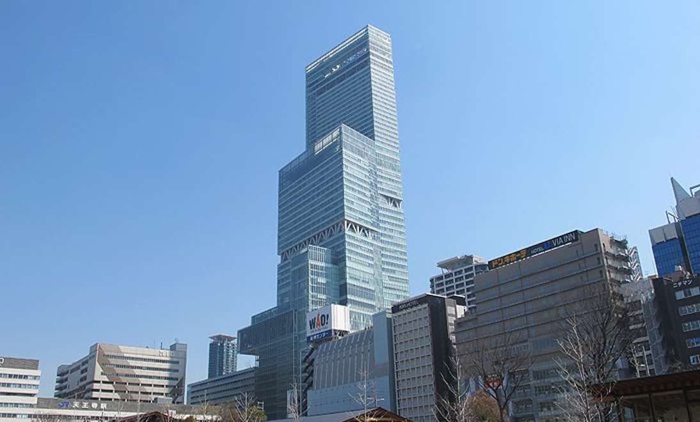
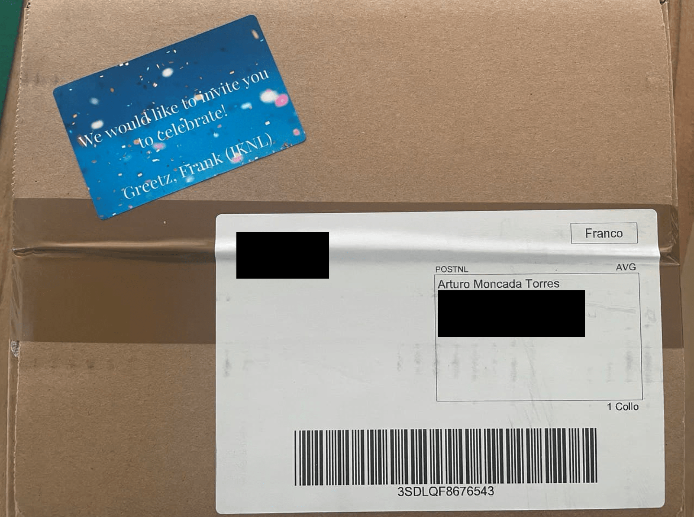
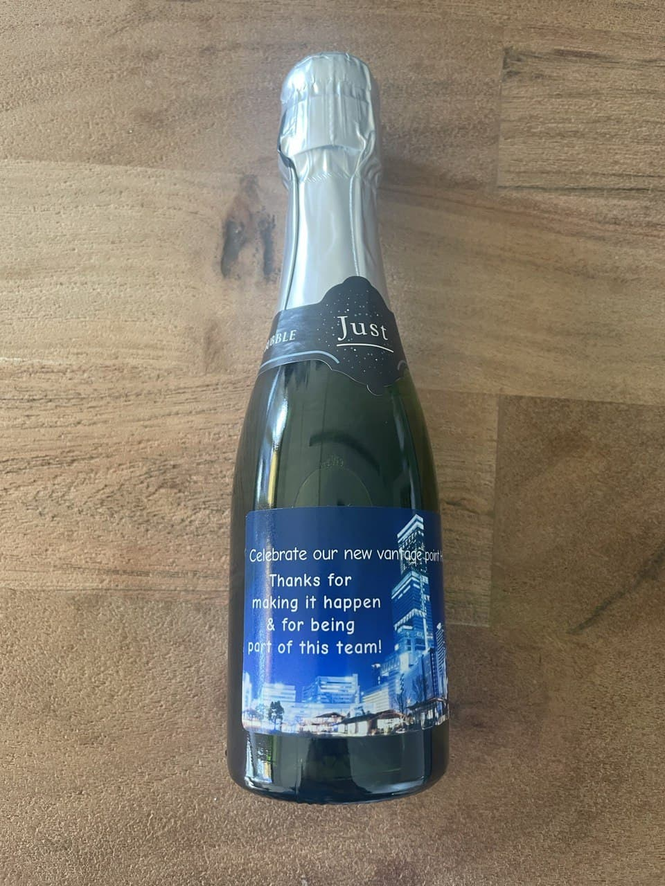
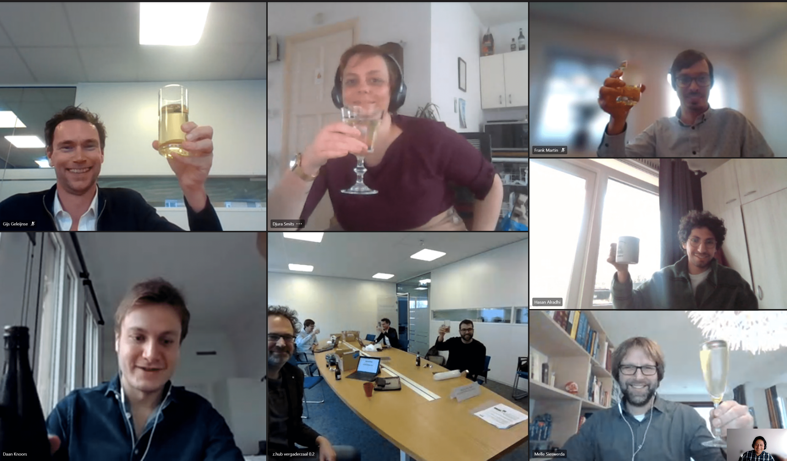

<figure class="alignleft">
	
</figure>

I am very happy to share that we have officially released VANTAGE6 version 2.0! This time, we named it after a Japanese vantage point: Harukas.

  

<!--more-->

Harukas is one of the tallest buildings in Osaka, with an altitude of 300 m. Its name comes from the old Japanese word "晴るかす" (harukasu), which can be roughly translated as "to brighten or to clear up". It hosts Japan's largest department store.

The new features of VANTAGE6 v2.0 (Harukas) include:

* Role-based access control
* Overhaul of the Python client (including management tools for the server)
* Implementation of `verbose` argument for server messages (very useful for debugging)
* A wide variety of CLI commands
* Better and more complete logging, including references to relevant documentation and Discord channel
* Several bug fixes

You can read more about them in VANTAGE6's official [release notes](https://docs.vantage6.ai/release-notes-1/2-harukas){: target="_blank"}.

-------

Since such occasion couldn't go unnoticed, we organized a small [*borrel*](https://dutchreview.com/expat/work/borrelen/){: target="_blank"} (or celebratory drinks) with vantage6's core team. Given the circumstances, it was done virtually. However, that came with its own set of surprises:

  <table><tr>
  <td>  </td>
  <td>  </td>
  </tr>
  </table>

We wanted to make this a fun event. Thus, together with my friend and colleague Frank, we prepared a vantage-oriented quiz. If you want to test your knowledge, you can find it [here](https://vantage6.ai/documents/12/harukas_quiz.ppsx){: target="_blank"} (and the corresponding answers [here](https://vantage6.ai/documents/13/harukas_quiz_answers.ppsx){: target="_blank"}). The members of the winning team managed to take home a tasty present 🤤.

Lastly, I would like to close this post with the now-classic screen capture of the virtual event. I am very happy to work with such smart people in such a cool project.

  

Looking forward to VANTAGE6 v3.0!

----------
If you want to know more about VANTAGE6, check [our official website](https://vantage6.ai/){: target="_blank"} or follow me on [Twitter (@amoncadatorres)](http://www.twitter.com/amoncadatorres){: target="_blank"} for more updates.
