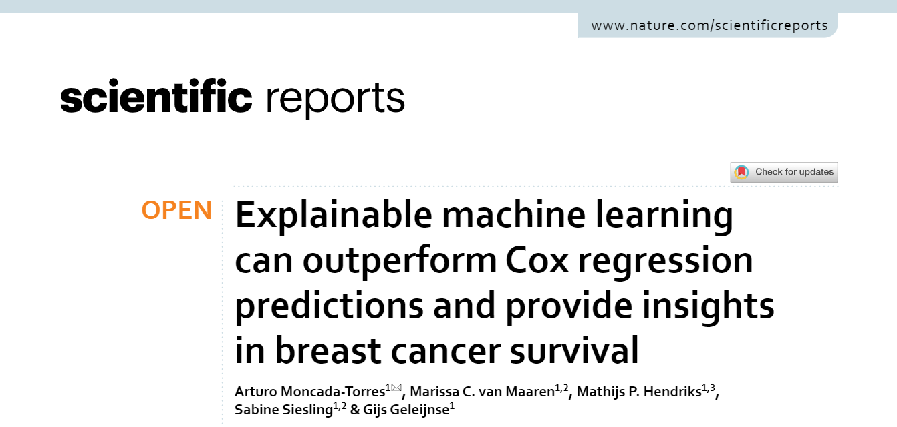

<figure class="alignleft">
	
</figure>
<figure class="alignleft">
	
</figure>

One of the projects that I have enjoyed the most as part of my job at IKNL has been the application of explainable machine learning to survival predictions. Well, today I woke up with the happy news that our latest study in this field has been accepted for publication in Scientific Reports!

  

<!--more-->

The abstract is as follows:

> Cox Proportional Hazards (CPH) analysis is the standard for survival analysis in oncology. Recently, several machine learning (ML) techniques have been adapted for this task. Although they have shown to yield results at least as good as classical methods, they are often disregarded because of their lack of transparency and little to no explainability, which are key for their adoption in clinical settings. In this paper, we used data from the Netherlands Cancer Registry of 36,658 non‑metastatic breast cancer patients to compare the performance of CPH with ML techniques (Random Survival Forests, Survival Support Vector Machines, and Extreme Gradient Boosting [XGB]) in predicting survival using the c‑index. We demonstrated that in our dataset, ML‑based models can perform at least as good as the classical CPH regression ( c‑index∼0.63), and in the case of XGB even better ( c‑index∼0.73 ). Furthermore, we used Shapley Additive Explanation (SHAP) values to explain the models’ predictions. We concluded that the difference in performance can be attributed to XGB’s ability to model nonlinearities and complex interactions. We also investigated the impact of specific features on the models’ predictions as well as their corresponding insights. Lastly, we showed that explainable ML can generate explicit knowledge of how models make their predictions, which is crucial in increasing the trust and adoption of innovative ML techniques in oncology and healthcare overall.

If you are interested, you can find the paper [here (Open Access)](https://www.nature.com/articles/s41598-021-86327-7){:target="_blank"} (and its corresponding [BibTeX citation here](../../bibtex/moncada-torres2021explainable.txt){:target="_blank"}).

Huge shoutout to all my co-authors. We are very proud of this achievement. I hope we can continue developing this project, which I believe will help us bring ML/AI solutions closer to every-day practice in clinics to reduce the impact of cancer in our patients.

----------
If you have any comments, questions or feedback, leave them in the comments below or drop me a line on Twitter [(@amoncadatorres)](https://twitter.com/amoncadatorres).
