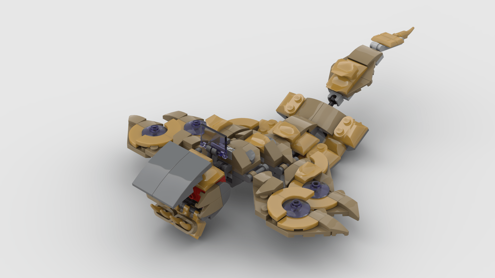

<figure class="alignleft">
	
</figure>
<figure class="alignleft">
	
</figure>

Unfortunately, LEGO's Avengers sets haven't always been on par with their corresponding MCU counterparts. Particularly, I think it sucks that it was only until 2019 that we got a [build of a Leviathan](https://www.lego.com/en-nl/product/avengers-hulk-helicopter-rescue-76144)... from a movie that was released on 2012. Not only that, but I think that the build looks very small, almost like of a baby Leviathan.

Therefore, I decided to take matters on my own hand. Using pieces exclusively from two small Leviathans, I created a Super Leviathan.

  

<!--more-->

The Super Leviathan has a larger head and body, as well as an extra pair of "wings". The build is nice, but a bit fragile on some points. I could have reinforced it in certain places, but that would have needed extra pieces. However, it shouldn't be very hard to do on your own with any additional bricks you have lying around.

I generated the instructions using [Bricklink Studio](https://www.bricklink.com/v3/studio/download.page){: target="_blank"}. You can find them here:

 

  

 

The instructions also include a bill of materials, in case you decide to build the Super Leviathan on your own. You can also find the inventory on its corresponding [Rebrickable page](https://rebrickable.com/mocs/MOC-75008/arturomoncadatorres/super-leviathan/#parts){: target="_blank"}. The instructions are free to download. However, you can always [buy me a cookie](https://www.buymeacoffee.com/amoncadatorres) if you want to show some appreciation.

## Gallery
If you build this model, please share some pictures! I'd love to add them here.

----------
If you have any questions, comments, or feedback, leave them in the comments below or [drop me a line on Twitter (@amoncadatorres)](https://twitter.com/amoncadatorres). Moreover, if you found this useful, fun, or just want to show your appreciation, you can always [buy me a cookie](https://www.buymeacoffee.com/amoncadatorres){: target="_blank"}. Cheers! 
