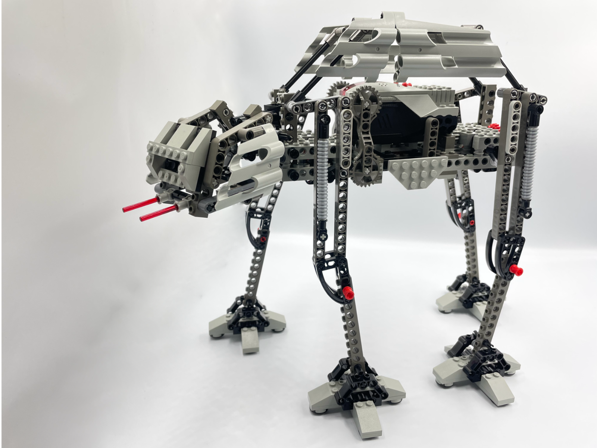

<figure class="alignleft">
	
</figure>
<figure class="alignleft">
	
</figure>

For this year's May the 4th, I wanted to create something special. This is what I came up with: an All Terrain Armored Transport using the MINDSTORMS 51515 set, or **AT-AT MS5** in short. There was a motorized AT-AT build in the Dark Side Developer Kit (9754). However, since it was released on 2000, I feel it was in urgent need of an update. What better than using the [MINDSTORMS Robot Inventor set 51515](https://www.lego.com/en-nl/product/robot-inventor-51515){: target="_blank"}. The robot was programmed using Python.

  

<!--more-->

----------

  <a href="#the-design">The Design</a> •
  <a href="#instructions">Instructions</a> •
  <a href="#program">Program</a> •
  <a href="#showcase">Showcase</a>  •
  <a href="#gallery">Gallery</a>

----------

## The Design
When designing the AT-AT MS5, my main objective was to give it a nice overhaul to make it look like a Robot Inventor-themed creation. Thus, I tried to make the build as "technic" as possible. For that purpose, I replaced almost all the studded parts with beams. Moreover, I tried to take advantage of the Robot Inventor's panels to give the AT-AT a robust, smooth look.

In the following pictures you can see a comparison of the different parts (legs, head, body) of the original build against their MS5 counterpart.

<table>
<tr>
<td>  </td>
<td>  </td>
</tr>
<tr>
<td>  </td>
<td>  </td>
</tr>
<tr>
<td>  </td>
<td>  </td>
</tr>
</table>

When we put everything together, this is how the AT-ATs look like:
<table>
<tr>
<td>  </td>
<td>  </td>
</tr>
<tr>
<td>  </td>
<td>  </td>
</tr>
</table>

## Instructions

I generated the instructions using [Bricklink Studio](https://www.bricklink.com/v3/studio/download.page){: target="_blank"}. You can find them here:

 

  

 

The instructions also include a bill of materials, in case you decide to build the AT-AT MS5 yourself. You can also find the inventory on its corresponding [Rebrickable page](https://rebrickable.com/mocs/MOC-75547/arturomoncadatorres/at-at-ms5/#parts){: target="_blank"}.

## Program

The robot functionality is quite simple. The AT-AT MS5 just walks in a straight line. However, what is quite interesting is *how* the motors are controlled. I programmed the robot in Python and used [Anton's Mindstorms motor synchronization](https://antonsmindstorms.com/2021/01/27/python-motor-synchronization-coordinating-multiple-spike-or-mindstorms-motors/) technique. This method is a very clever way to make two (or more) motors work together smoothly. In short, we define mathematical functions that describe the motors' movement (in this case, I defined piece-wise linear functions that describe the movement of each leg). This is particularly handy for the AT-AT MS5, since the legs movement have quite a peculiar pattern:

  

For a complete, detailed description of how this approach works, I strongly recommend checking [the AT-AT MS5's Jupyter notebook](https://nbviewer.jupyter.org/github/arturomoncadatorres/lego-mindstorms/blob/main/mocs/atat_ms5/programs/atat_ms5.ipynb?flush_cache=True){: target="_blank"} (if `nbviewer` is giving you trouble, you can also [check the notebook directly in GitHub](http://github.com/arturomoncadatorres/lego-mindstorms/blob/main/mocs/atat_ms5/programs/atat_ms5.ipynb?flush_cache=True){: target="_blank"}). If you just want to get the robot up and running, you can find the [script here](https://github.com/arturomoncadatorres/lego-mindstorms/blob/main/mocs/atat_ms5/programs/atat_ms5.py){: target="_blank"}. To use it, just copy and paste the content of the script in a new MINDSTORMS Python project and you will be good to go.

 

  

 

## Showcase

The best part: seeing the whole thing in action!

  

I love how the looked turned out. Unfortunately, as you can see, the AT-AT MS5 doesn't perform very well on smooth surfaces 😅. I guess a redesign of the legs could have helped. However, I needed the pieces for another MOC, so I decided to leave it as it is. I have to admit that in the end it turned out quite funny.

## Gallery
If you build this model, please share some pictures! I'd love to add them here.

----------
If you have any questions, comments, or feedback, please [open a discussion](https://github.com/arturomoncadatorres/lego-mindstorms/discussions). If there is a problem with the code (e.g., mistake), please [open an issue](https://github.com/arturomoncadatorres/lego-mindstorms/issues). Moreover, you can always drop me a line on Twitter [(@amoncadatorres)](https://twitter.com/amoncadatorres). Lastly, if you found this useful, fun, or just want to show your appreciation, you can always [buy me a cookie](https://www.buymeacoffee.com/amoncadatorres){: target="_blank"}. Cheers! 
