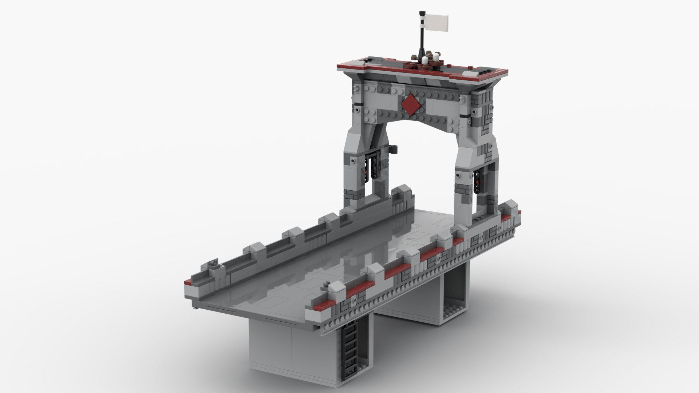

<figure class="alignleft">
	
</figure>
<figure class="alignleft">
	
</figure>

I absolutely love the 76057 set (Spider-Man: Web Warriors Ultimate Bridge Battle). I think it is one of the best LEGO Marvel sets ever made. It has something for everyone: fantastic selection of minifigs, tons of play features, and a very solid, detailed bridge build. However, my least favorite part was the road of the bridge. The black plates made it look a bit too bland and artificial (even for a plastic toy).

On 2021, LEGO released a new type of road plates (set 60304), which are very easy to couple to other builds (in contrast to the previous versions). As soon as I saw them, I knew I had to try incorporating them into the original bridge. I must say I am very happy with the results!

  

<!--more-->

## Design

My number one priority was to make sure that this build used only pieces from the original sets (76057 and 60304) and nothing else. No one wants to cannibalize existing sets or have to wait for those extra pieces to arrive.

The new road plates make the bridge four studs wider than it originally was. Thus, I had to extend also the bridge tower. It was tricky to do so subtly enough so it didn't looked weird or patched. However, the hardest challenge was to find enough 2-by-whatever plates for the construction of the bridge's parapets. After getting a bit creative and replacing some plates here and there, it was finally possible.

Unfortunately, I had to sacrifice a couple of play features. Namely, I removed the road trapdoor, the destroyable walls (since I used those extra pieces to extend the tower), the displaceable parapet, and the edge where you can push Spidey from the tower (although I think that if you like that one, you can keep it). However, I think that people interested in this MOC will want to incorporate it into their own LEGO cities and probably aren't that much interested in play features anyhow.

A big part of the 76057 set pieces are used as structure for the bridge's road. However, since the road plates are quite sturdy and can be assembled very easily on their own, this build will leave you with quite a few leftover pieces.

## Instructions

Please notice that the instructions are for the build of the bridge only. For the sake of simplicity, I omitted the details such as Kraven's lair or the bridge chains. However, as you can imagine, incorporating these details is very straightforward.

I generated the instructions using [Bricklink Studio](https://www.bricklink.com/v3/studio/download.page){: target="_blank"}. You can find them here:

 

  

 

The instructions also include a bill of materials, in case you decide to build the bridge on your own. You can also find the inventory on its corresponding [Rebrickable page](https://rebrickable.com/mocs/MOC-77395/arturomoncadatorres/spider-man-bridge-battle-lego-city-roadplates/#parts){: target="_blank"}. The instructions are free to download. However, you can always [buy me a cookie](https://www.buymeacoffee.com/amoncadatorres) if you want to show some appreciation.

## Gallery
If you build this model, please share some pictures! I'd love to add them here.

----------
If you have any questions, comments, or feedback, leave them in the comments below or [drop me a line on Twitter (@amoncadatorres)](https://twitter.com/amoncadatorres). Moreover, if you found this useful, fun, or just want to show your appreciation, you can always [buy me a cookie](https://www.buymeacoffee.com/amoncadatorres){: target="_blank"}. Cheers! 
