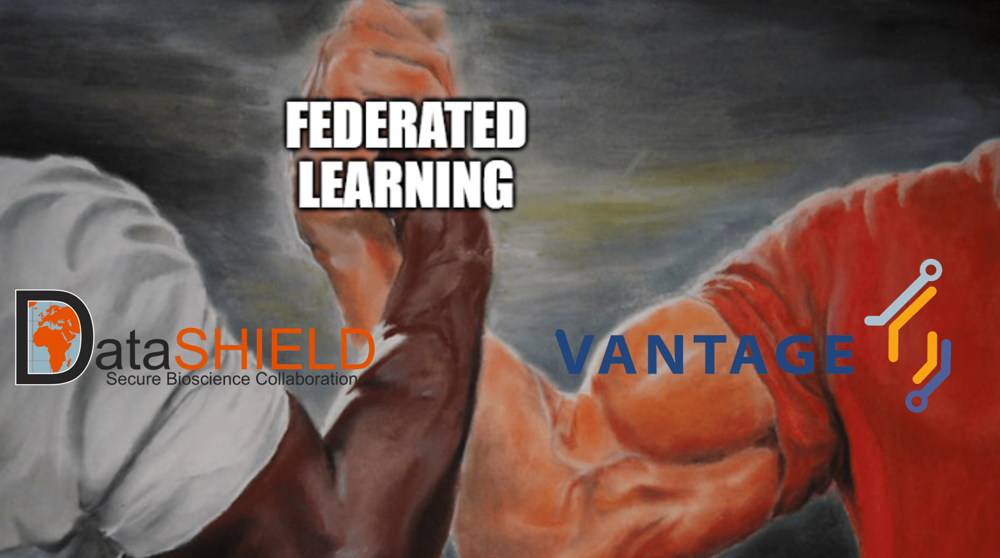
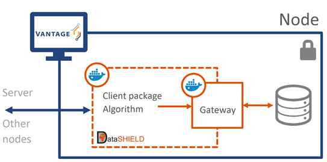

<figure class="alignleft">
	
</figure>

The federated learning landscape is evolving incredibly fast. This is in big part due to its fantastic community, which is pushing the boundaries of what decentralized analysis can do. Moreover, the intrinsic nature of this technology promotes collaborations across different parties. As one of these collaborations, I am thrilled to announce a partnership between vantage6 and DataSHIELD.

  

<!--more-->

In case you don’t know, DataSHIELD is an R-based software package for federated analyses of biomedical, healthcare and social-science data. Established in 2013, it is an innovative, game-changing initiative that is being continuously developed by the federated learning community. The DataSHIELD team is based at Newcastle University, but development is now also spread to a community based around the EUCAN-Connect project. You can learn more about them [here](https://datashield.org/).

#### What is the purpose of this partnership?
Our objective is to leverage the best of these two solutions: we want to make the extensive DataSHIELD toolset available through vantage6. In other words, users of vantage6 will be able to use the well curated and carefully reviewed analysis methods in DataSHIELD, all while keeping the data of each party safe. Going a little bit more into detail, this is the proposed general concept:

  

In this scenario, vantage6 would provide the framework for the whole project. This includes managing collaborations, authorizing users, handling computation requests, delivering algorithms, storing results, and setting up the server (if needed) and nodes.

At its core, each node would accommodate two DataSHIELD Docker images: a client and a gateway. On one hand, the client would contain the analysis scripts (i.e., the actual algorithm used to answer the research question being investigated). It is worth mentioning that DataSHIELD has already implemented a large toolbox of relevant operations and functions. On the other hand, the gateway would be configured to access the data (through a platform such Opal or Armadillo). This way, parties could approve only Docker images that comply with their privacy requirements, ensuring that the algorithms have non-disclosive access to the data.

Please note that this is work in progress and is subject to modifications in the future. *If you want to be part of the conversation or, even better, want to actively contribute, don’t hesitate to reach out!*

#### When 1 + 1 = 3
We believe that the synergy between these two solutions will greatly benefit the federated learning field, by providing even more (open-source) options to execute their analyses. We are very excited about this partnership and really looking forward to seeing the value that these tools will bring to the community.

----------
If you want to know more about vantage6, check [its website](https://vantage6.ai/){: target="_blank"} or follow me on [Twitter (@amoncadatorres)](http://www.twitter.com/amoncadatorres){: target="_blank"}.
You can read more about DataSHIELD on [their website](https://datashield.org/) or on their Twitter account as well ([@Datashieldnews](https://twitter.com/DatashieldNews))!
