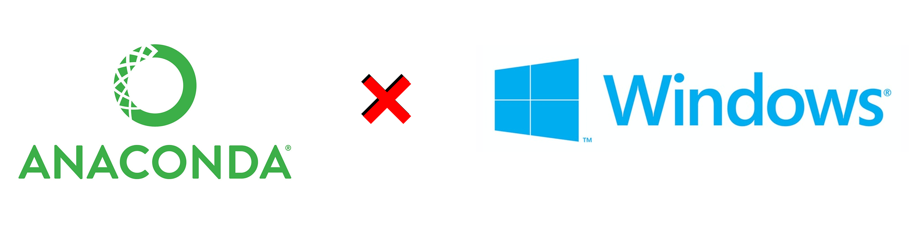
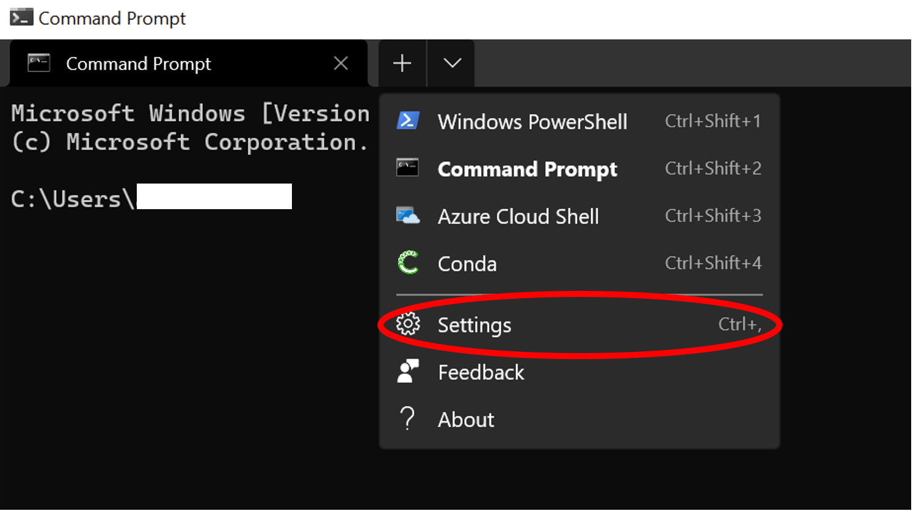
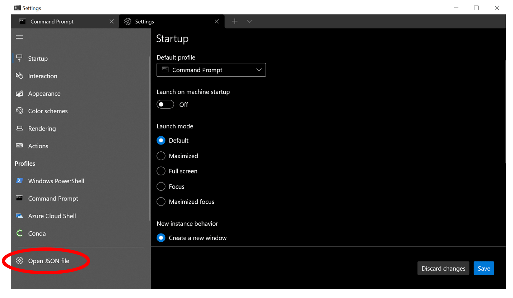
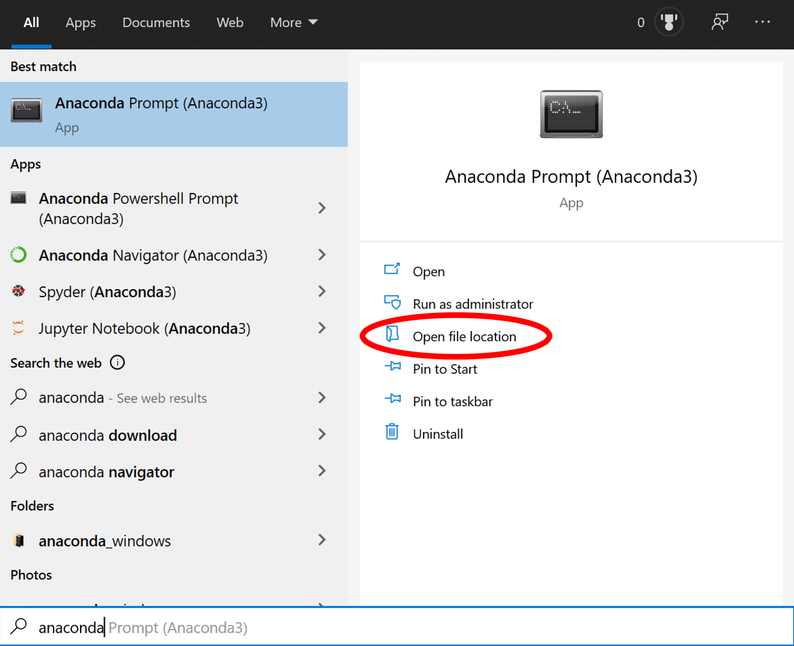
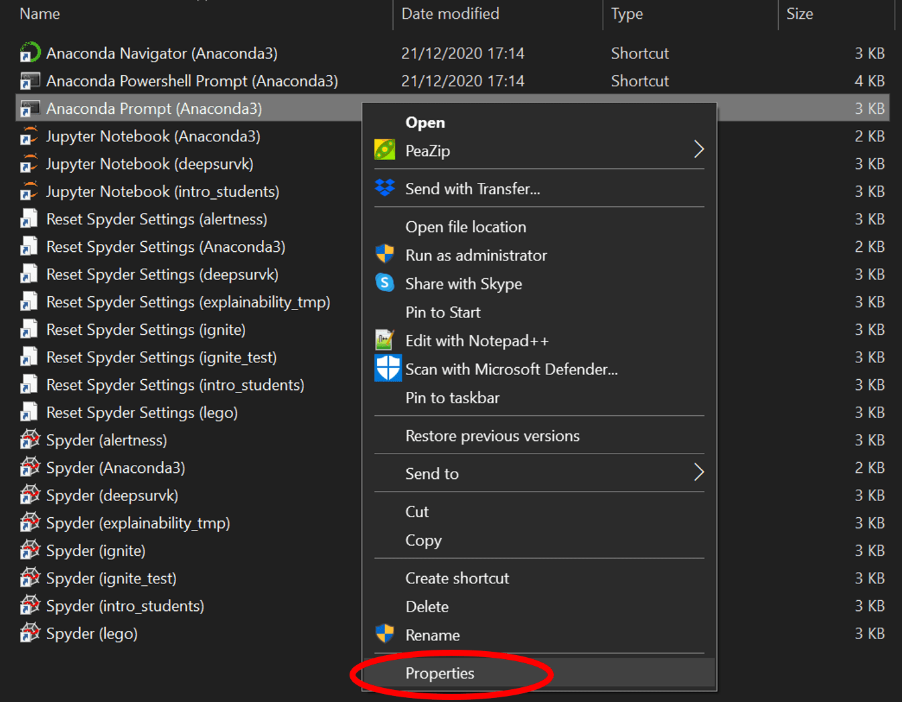
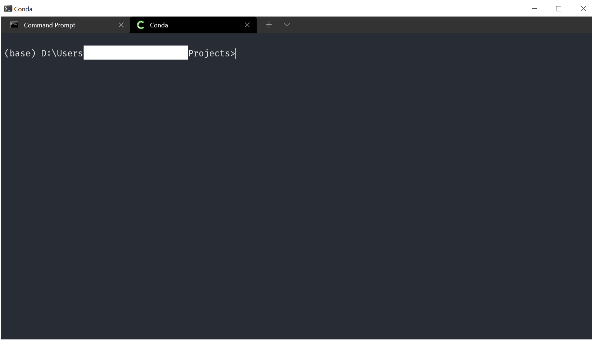

<figure class="alignleft">
	
</figure>

[Anaconda](https://www.anaconda.com/){: target="_blank"} is a fantastic software distribution that has everything that you need to start your Data Science projects. It comes with its own package manager, `conda`, which includes its own command prompt. It is great to manage your environments and launch your tools. However, when you need more than one command prompt open (which happens quite often), it is very annoying to have them spread all over the place. Having them under a single window with a tab system would be much handier. Enter Windows Terminal.

  

In this post, I will share the steps that I followed to incorporate Anaconda's Prompt into it.

<!--more-->

## 0. Get Anaconda
I assume that you have already installed Anaconda. If not, you can [download it from its website](https://www.anaconda.com/products/individual){: target="_blank"}.

## 1. Get Windows Terminal

The Windows Terminal comes bundled as part of Windows 11. However, if you have Windows 10 or earlier, you can [download it for free from the Microsoft App Store](https://www.microsoft.com/en-us/p/windows-terminal/9n0dx20hk701?activetab=pivot:overviewtab){: target="_blank"}.

## 2. Open the Windows Terminal JSON configuration file

Open your freshly installed Windows Terminal. Then, click on the arrow pointing downwards on the tab ribbon and select `Settings` (or use the shortcut `Ctrl + ,`)

  

In the settings tab, look on the bottom left corner and click on `Open JSON file`

  

This will open the configuration file in your preferred text editor ([Notepad++](https://notepad-plus-plus.org/){: target="_blank"} in my case)

## 3. Customize the Windows Terminal JSON configuration file

In here, we will create a new profile. Go to the section `profiles` (which should be around line 34). Then, we will add a new element to `profiles.list`. It should have at least the following elements:

* `name`: Straightforward. I chose `Conda`
* `hidden`: We actually want to see it, so set this to `false`
* `guid`: We need a globally unique identifier - or GUID. As its name states, a GUID uniquely identifies a piece of installed software among all of the other pieces of software on a computer. Generating one is very easy. Simply open a Windows PowerShell and run the command `New-Guid`. Copy and paste the output here. It must be enclosed between curly braces.
* `commandline`: This one is a bit more cumbersome. Here, we need to specify what command line we want to execute. In other words, we need to give the instruction to open an Anaconda prompt. To do so, we first need to find where it is in our system. In Windows Start, look for `Anaconda` and open the location of the Anaconda Prompt:

  

Then, right click on the Anaconda Prompt shortcut and go to `Properties` (be careful that you do *not* choose the Anaconda Powershell):

  

In here, copy whatever's on the field `Target` and paste it in an empty document of your preferred text editor. We will reshape it from something like this

`%windir%\System32\cmd.exe "/K" C:\ProgramData\Anaconda3\Scripts\activate.bat C:\ProgramData\Anaconda3`

to something like this

`cmd.exe /K C:\\ProgramData\\Anaconda3\\Scripts\\activate.bat`

Copy and paste the latter in the `commandline` field.

We can also add some additional tweaks and preferences, such as:

* `icon`: Path to an image that will be used as an icon. I used a Conda one that was installed in my system.
* `startingDirectory`: Straightforward.
* `fontFace`: Your preferred font. I like [`Fira Code`](https://twitter.com/amoncadatorres/status/1284143485063434240?s=20){: target="_blank"} very much.
* `colorScheme`: From the ones available to the Windows Terminal. I like `One Half Dark` (you can, of course, use a different one and even generate a new one!)

In the end, the whole thing should look like this:


,
{
    "colorScheme": "One Half Dark",
    "commandline": "cmd.exe /K C:\\ProgramData\\Anaconda3\\Scripts\\activate.bat",
    "fontFace": "Fira Code",
    "guid": "{xxxxxxxx-xxxx-xxxx-xxxx-xxxxxxxxxxxx}",
    "hidden": false,
    "icon": "C:\\ProgramData\\Anaconda3\\pkgs\\conda-4.9.2-py38haa95532_0\\Lib\\site-packages\\conda\\shell\\conda_icon.ico",
    "name": "Conda",
    "startingDirectory": "D:/Users/your_user_name/Documents"
}

Don't forget the comma `,` at the beginning! It is needed to separate the newly created profile from the old ones. Remember to use your own generated GUID. Lastly, be careful to use quotation marks appropriately. If you have any (syntax) errors, you will get a message from the Windows Terminal settings window. Go to the given line and column to fix them.

That's it! Now you can have a Conda prompt nice and tidy within the Windows Terminal:

  

----------
If you have any comments, questions or feedback, leave them in the comments below [or drop me a line on Twitter (@amoncadatorres)](http://www.twitter.com/amoncadatorres){: target="_blank"}. Moreover, if you found this useful, fun, or just want to show your appreciation, you can always [buy me a cookie](https://www.buymeacoffee.com/amoncadatorres){: target="_blank"}. Cheers!
