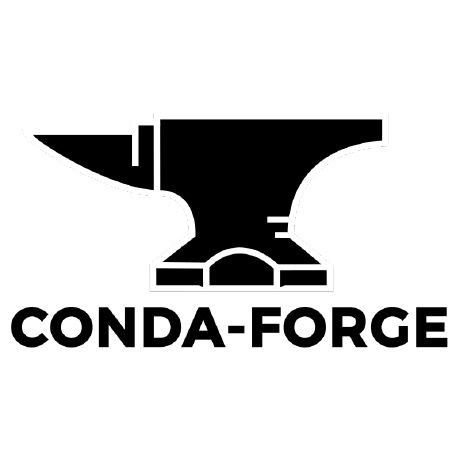
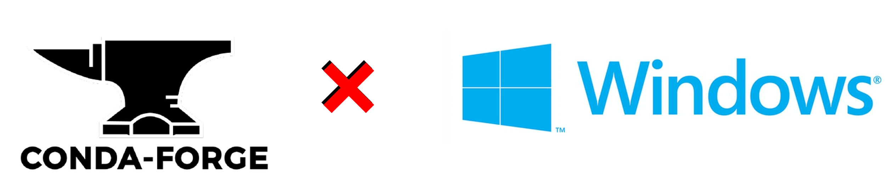
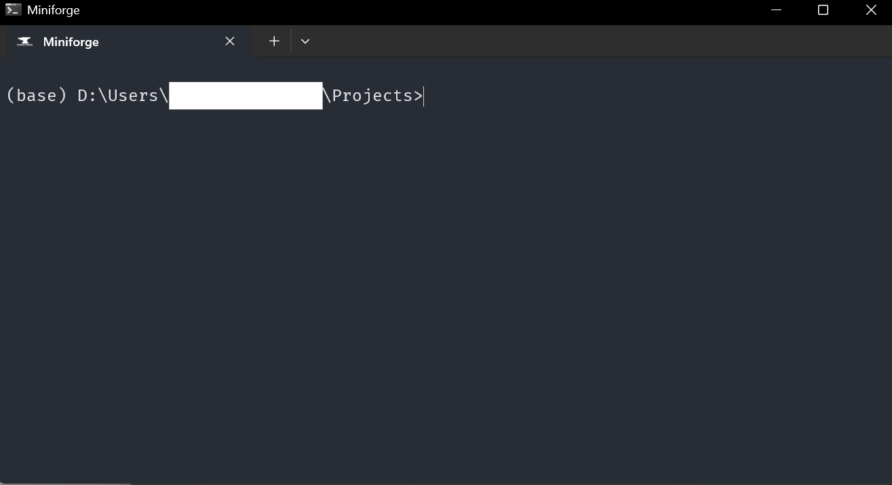

<figure class="alignleft">
	
</figure>

*2025-05 Update: in the past, this post provided instructions to use Anaconda. However, recently I fell out of love with it, moved to Miniforge and never looked back.*

[Miniforge](https://github.com/conda-forge/miniforge){: target="_blank"} is a fantastic open-source edition of Conda perfect for managing your environments and packages in your Data Science projects. It comes with its own package command prompt, which is very useful on its own. However, what is even better is incorporating it into your Windows Terminal. For example, this gives you more options regarding what you can customize, it even allows you to have different tabs for each open command prompt.

  

In this post, I will share the steps that I followed to incorporate Miniforge's Prompt into it.

<!--more-->

## 0. Get Miniforge
I assume that you have already installed Miniforge. If not, you can just follow the [instructions](https://github.com/conda-forge/miniforge?tab=readme-ov-file#install){: target="_blank"}.

## 1. Get Windows Terminal

The Windows Terminal comes bundled as part of Windows 11. However, if you have Windows 10 or earlier, you can [download it for free from the Microsoft App Store](https://www.microsoft.com/en-us/p/windows-terminal/9n0dx20hk701?activetab=pivot:overviewtab){: target="_blank"}.

## 2. Open the Windows Terminal JSON configuration file

Open your freshly installed Windows Terminal. Then, click on the arrow pointing downwards on the tab ribbon and select `Settings` (or use the shortcut `Ctrl + ,`)

  

In the settings tab, look on the bottom left corner and click on `Open JSON file`

  

This will open the configuration file in your preferred text editor ([Notepad++](https://notepad-plus-plus.org/){: target="_blank"} in my case)

## 3. Customize the Windows Terminal JSON configuration file

In here, we will create a new profile. Go to the section `profiles` (which should be around line 34). Then, we will add a new element to `profiles.list`. It should have at least the following elements:

* `name`: Straightforward. I chose `Miniforge`
* `hidden`: We actually want to see it, so set this to `false`
* `guid`: We need a globally unique identifier - or GUID. As its name states, a GUID uniquely identifies a piece of installed software among all of the other pieces of software on a computer. Generating one is very easy. Simply open a Windows PowerShell and run the command `New-Guid`. Copy and paste the output here. It must be enclosed between curly braces.
* `commandline`: This one is slightly more cumbersome. Here, we need to specify what command line we want to execute. In other words, we need to give the instruction to open a Miniforge prompt. [To do so](https://github.com/conda-forge/miniforge/issues/136){: target="_blank"}, we need the path where Miniforge was installed. If you didn't change the defaults, this is usually in `C:\Users\your_user_name\miniforge3`. Go there and double check that the file `Scripts\activate` exists. If so, fill the `commandline` with:

`cmd.exe /K C:\\Users\\your_user_name\\miniforge3\\Scripts\\activate`

We can also add some additional tweaks and preferences, such as:

* `icon`: Path to an image that will be used as an icon. I downloaded the [image used in Miniforge's GitHub repository](https://images.app.goo.gl/P2vbrEJttURm3o557){: target="_blank"}, converted it to a `.ico`, and saved it to the root directory of my Miniforge installation.
* `startingDirectory`: Straightforward.
* `fontFace`: Your preferred font. I like [`Fira Code`](https://twitter.com/amoncadatorres/status/1284143485063434240?s=20){: target="_blank"} very much.
* `colorScheme`: From the ones available to the Windows Terminal. I like `One Half Dark` (you can, of course, use a different one and even generate a new one!)

In the end, the whole thing should look like this:


,
{
    "colorScheme": "One Half Dark",
    "commandline": "cmd.exe /K C:\\Users\\your_user_name\\miniforge3\\Scripts\\activate.bat",
    "fontFace": "Fira Code",
    "guid": "{xxxxxxxx-xxxx-xxxx-xxxx-xxxxxxxxxxxx}",
    "hidden": false,
    "icon": "C:\\Users\\your_user_name\\miniforge3\\miniforge_icon_white.ico",
    "name": "Miniforge",
    "startingDirectory": "D:/Users/your_user_name/Documents"
}


Don't forget the comma `,` at the beginning! It is needed to separate the newly created profile from the old ones. Remember to use your own generated GUID. Lastly, be careful to use quotation marks appropriately. If you have any (syntax) errors, you will get a message from the Windows Terminal settings window. Go to the given line and column to fix them.

That's it! Now you can have a Miniforge prompt nice and tidy within the Windows Terminal:

  

----------
If you have any comments, questions or feedback, leave them in the comments below [or drop me a line on Twitter (@amoncadatorres)](http://www.twitter.com/amoncadatorres){: target="_blank"}. Moreover, if you found this useful, fun, or just want to show your appreciation, you can always [buy me a cookie](https://www.buymeacoffee.com/amoncadatorres){: target="_blank"}. Cheers!
