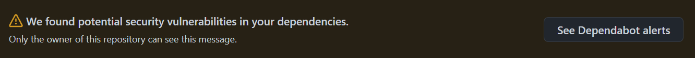

<figure class="alignleft">
	
</figure>
<figure class="alignleft">
	
</figure>

I use [Jekyll](https://jekyllrb.com/){: target="_blank"} and [GitHub Pages](https://pages.github.com/){: target="_blank"} to host my website. Every now and then, I get the following message

<figure class="aligncenter">
	
</figure>

Usually, you can do nothing about it and the website would still work. However, it is important to fix these dependency issues to make sure that it remains secure. In this post I will explain how I do it - hopefully it will be useful for you too.

<!--more-->
## 1. Understanding Jekyll
First, it is a good idea to understand how Jekyll works. Their website has a [great guide about it](https://jekyllrb.com/docs/ruby-101/){: target="_blank"} and I recommend you go through it. In short, Jekyll is written in [`Ruby`](https://www.ruby-lang.org/en/){: target="_blank"} and uses [`Bundler`](https://bundler.io/){: target="_blank"} to handle its dependencies. If you are like me and come from a `Python` background, the way I see it is that `Bundler` works as `conda` or `poetry` to ensure that the packages (or gems, in `Ruby` terms) have the right version.

To do so, `Bundler` creates two files: `Gemfile` and `Gemfile.lock`. [So what's the difference between them?](https://stackoverflow.com/questions/6927442/what-is-the-difference-between-gemfile-and-gemfile-lock-in-ruby-on-rails){: target="_blank"} In `Gemfile`, you can specify which gems you wish to use, as well as their corresponding versions, which can be, for example, `>=1.0.0` (i.e., version 1.0.0 or more recent). `Bundler` creates `Gemfile.lock` and records the *exact* versions that were installed. This ensures that when the website is generated, it uses the versions defined in `Gemfile.lock` (instead of the most recent ones as defined in `Gemfile`, which can potentially cause issues).

## 2. Solving the dependency vulnerabilities
Now that we know how Ruby (and Jekyll) deals with dependencies, we can proceed and fix the vulnerabilities. In my experience these are always caused by outdated dependencies.

This is actually quite simple:

1. Open a terminal with admin rights and go to your website root directory
1. Delete the `Gemfile.lock` file. You can do this either through the terminal

    `del Gemfile.lock` (for Windows)
    `rm Gemfile.lock` (for Mac/Linux)

     or through the file explorer. Alternatively, you can also cut it and paste it in another location for safekeeping.
1. Run the command

    `bundle update`

    which will generate a new `Gemfile.lock` with the proper, most updated dependencies (and therefore, with no vulnerabilities)
1. Commit and push the new `Gemfile.lock` to your GitHub repository
1. Done!

This should allow you to solve all, if not all, of the dependency issues in your Jekyll GitHub Pages website. If you want to know more about the topic, take a look at [my other posts](https://arturomoncadatorres.com/tag/jekyll).

----------
If you have any comments, questions or feedback, leave them in the comments below [or drop me a line on Twitter (@amoncadatorres)](http://www.twitter.com/amoncadatorres){: target="_blank"}. Moreover, if you found this useful, fun, or just want to show your appreciation, you can always [buy me a cookie](https://www.buymeacoffee.com/amoncadatorres){: target="_blank"}. Cheers!
