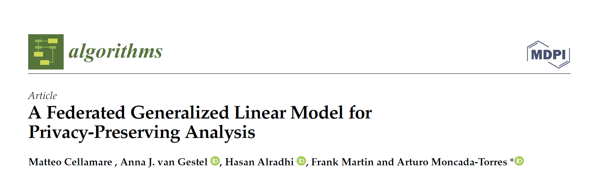

<figure class="alignleft">
	
</figure>
<figure class="alignleft">
	
</figure>

I am happy to share that our latest paper is out! Here, we present a federated implementation of a generalized linear model ([GLM](https://github.com/IKNL/vantage6-algorithms/blob/glm/models/glm/README.md){:target="_blank"}) for analyzing horizontally-partitioned data. We show the maths behind it, as well as its [validation](https://github.com/IKNL/vantage6-algorithms/tree/glm/models/glm/src/validation){:target="_blank"} (done in R). This is part of the work that we are doing with [vantage6](https://vantage6.ai/){:target="_blank"}.

  

The abstract is as follows:

<!--more-->

> In the last few years, federated learning (FL) has emerged as a novel alternative for analyzing data spread across different parties without needing to centralize them. In order to increase the adoption of FL, there is a need to develop more algorithms that can be deployed under this novel privacy-preserving paradigm. In this paper, we present our federated generalized linear model (GLM) for horizontally partitioned data. It allows generating models of different families (linear, Poisson, logistic) without disclosing privacy-sensitive individual records. We describe its algorithm (which can be implemented in the user’s platform of choice) and compare the obtained federated models against their centralized counterpart, which were mathematically equivalent. We also validated their execution time with increasing numbers of records and involved parties. We show that our federated GLM is accurate enough to be used for the privacy-preserving analysis of horizontally partitioned data in real-life scenarios. Further development of this type of algorithm has the potential to make FL a much more common practice among researchers.

If you are interested, you can find the paper [here (Open Access)](https://mdpi.com/1999-4893/15/7/243/){:target="_blank"} (and its corresponding [BibTeX citation here](https://arturomoncadatorres.com/bibtex/cellamare2022federated.txt){:target="_blank"}).

Thank you very much to all my co-authors. Without their effort, this work wouldn't have been possible.

----------
If you have any comments, questions or feedback, leave them in the comments below or drop me a line on Twitter [(@amoncadatorres)](https://twitter.com/amoncadatorres).
