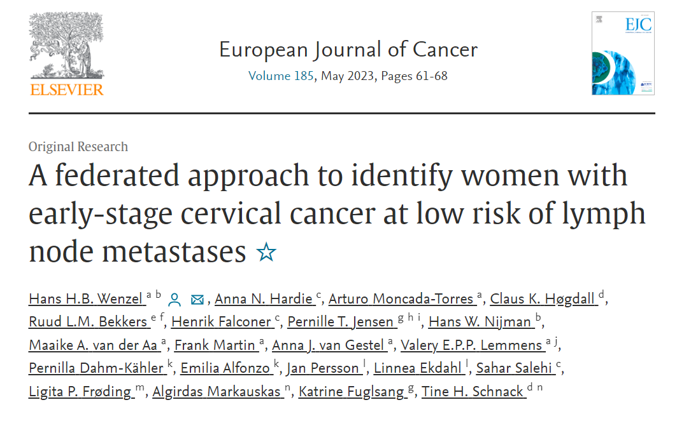

<figure class="alignleft">
	
</figure>
<figure class="alignleft">
	
</figure>

After more than two years of work, I am happy to share that our latest paper is out! Here, we used federated learning (more specifically, the logistic regression flavor of our previously published [GLM model](https://arturomoncadatorres.com/new-paper-federated-glm/){:target="_blank"}) to identify women at low risk of pN+ cervical cancer. This work has the potential to be used as a guide in shared decision-making process when considering the extent of lymph node dissection.

  

The abstract is as follows:

<!--more-->

> *Objective*
> Lymph node metastases (pN+) in presumed early-stage cervical cancer negatively impact prognosis. Using federated learning, we aimed to develop a tool to identify a group of women at low risk of pN+, to guide the shared decision-making process concerning the extent of lymph node dissection.
>
> *Methods*
Women with cervical cancer between 2005 and 2020 were identified retrospectively from population-based registries: the Danish Gynaecological Cancer Database, Swedish Quality Registry for Gynaecologic Cancer and Netherlands Cancer Registry. Inclusion criteria were: squamous cell carcinoma, adenocarcinoma or adenosquamous carcinoma; The International Federation of Gynecology and Obstetrics 2009 IA2, IB1 and IIA1; treatment with radical hysterectomy and pelvic lymph node assessment. We applied privacy-preserving federated logistic regression to identify risk factors of pN+. Significant factors were used to stratify the risk of pN+.
>
> *Results*
We included 3606 women (pN+ 11%). The most important risk factors of pN+ were lymphovascular space invasion (LVSI) (odds ratio [OR] 5.16, 95% confidence interval [CI], 4.59–5.79), tumour size 21–40 mm (OR 2.14, 95% CI, 1.89–2.43) and depth of invasion>10 mm (OR 1.81, 95% CI, 1.59–2.08). A group of 1469 women (41%)—with tumours without LVSI, tumour size ≤20 mm, and depth of invasion ≤10 mm—had a very low risk of pN+ (2.4%, 95% CI, 1.7–3.3%).
>
> *Conclusion*
Early-stage cervical cancer without LVSI, a tumour size ≤20 mm and depth of invasion ≤10 mm, confers a low risk of pN+. Based on an international privacy-preserving analysis, we developed a useful tool to guide the shared decision-making process regarding lymph node dissection.

This was a project with a lot of moving parts. Moreover, a big part of its development took place during the pandemic. I have to say that this makes seeing the final product much more satisfactory.

If you are interested, you can find the paper [here](https://www.sciencedirect.com/science/article/abs/pii/S0959804923001120){:target="_blank"} (and its corresponding [BibTeX citation here](https://arturomoncadatorres.com/bibtex/wenzel2023federated.txt){:target="_blank"}).

----------
If you have any comments, questions or feedback, leave them in the comments below or drop me a line on Twitter [(@amoncadatorres)](https://twitter.com/amoncadatorres).
