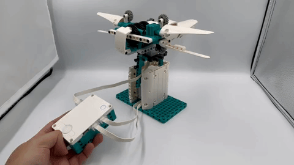
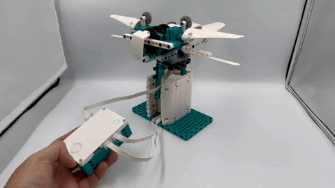
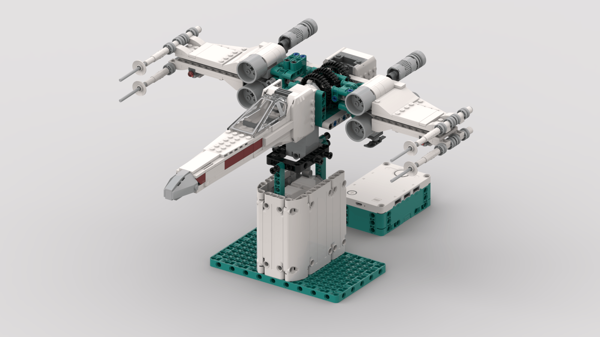

<figure class="alignleft">
	
</figure>
<figure class="alignleft">
	
</figure>

In celebration of 2023's May the 4th, I have created an X-Wing Starfighter using the MINDSTORMS 51515 set, or **X-Wing MS5** in short. Not only is this one of the most iconic Star Wars ships, but it also aligns nicely with this year's release of the [X-Wing UCS set](https://www.lego.com/us-en/product/x-wing-starfighter-75355){: target="_blank"}. The robot was built using the [MINDSTORMS Robot Inventor set 51515](https://www.lego.com/en-nl/product/robot-inventor-51515){: target="_blank"} and programmed using Python.

  

<!--more-->

Please note that this isn't an original concept. The first version concept that I saw of it was that by [LEGORobotics Mr. Hino](https://www.youtube.com/watch?v=9LORehcdxRA&){: target="_blank"} using the EV3 kit. In this case, Mr. Hino used a motor as a joystick to control the angle. However, I haven't seen an implementation using the Robot Inventor (51515) set or using an accelerometer to control the ship.

----------

  <a href="#instructions">Instructions</a> •
  <a href="#program">Program</a> •
  <a href="#showcase">Showcase</a>  •
  <a href="#gallery">Gallery</a>  •
  <a href="#miscellaneous">Miscellaneous</a>

----------

## Instructions

I generated the instructions using [Bricklink Studio](https://www.bricklink.com/v3/studio/download.page){: target="_blank"}. You can find them here:

 

  

 

The instructions also include a bill of materials, in case you decide to build the AT-AT MS5 yourself. You can also find the inventory on its corresponding [Rebrickable page](https://rebrickable.com/mocs/MOC-147490/arturomoncadatorres/x-wing-ms5/#parts){: target="_blank"}.

## Program

The robot functionality is quite simple. The ship will angle along the z-axis depending on the hub's orientation (using information from the accelerometer). It also allows switching [between cruise and attack mode](https://scifi.stackexchange.com/questions/6001/why-do-x-wings-change-wing-configuration){: target="_blank"}. While in the latter, the X-Wing can fire its laser cannons.

For a complete, detailed description of how this approach works, I strongly recommend checking the X-Wing MS5's [Jupyter notebook](https://nbviewer.jupyter.org/github/arturomoncadatorres/lego-mindstorms/blob/main/mocs/xwing_ms5/programs/xwing_ms5.ipynb?flush_cache=True){: target="_blank"} (if `nbviewer` is giving you trouble, you can also [check the notebook directly in GitHub](http://github.com/arturomoncadatorres/lego-mindstorms/blob/main/mocs/xwing_ms5/programs/xwing_ms5.ipynb?flush_cache=True){: target="_blank"}). If you just want to get the robot up and running, you can find the [script here](https://github.com/arturomoncadatorres/lego-mindstorms/blob/main/mocs/xwing_ms5/programs/atat_ms5.py){: target="_blank"}. To use it, just copy and paste the content of the script in a new MINDSTORMS Python project and you will be good to go.

 

  

 

## Showcase

The best part: seeing the whole thing in action!

  

  

(I'm still editing a video showcasing the functionality. On the meantime, I think that these GIFs should give you a good idea of how the robot works.)

## Gallery
If you build this model, please share some pictures! I'd love to add them here.

## Miscellaneous
A bit of backstory. Originally, I wanted to just create the core mechanism and append the S-foil and cockpit of [75301's Luke Skywalker's X-Wing Fighter](https://www.lego.com/en-us/product/luke-skywalker-s-x-wing-fighter-75301). However, this resulted in the X-Wing being too heavy, making it very hard for the motors to work. As a small bonus, here is a render of how that looks like.

  

----------
If you have any questions, comments, or feedback, please [open a discussion](https://github.com/arturomoncadatorres/lego-mindstorms/discussions). If there is a problem with the code (e.g., mistake), please [open an issue](https://github.com/arturomoncadatorres/lego-mindstorms/issues). Moreover, you can always drop me a line on Twitter [(@amoncadatorres)](https://twitter.com/amoncadatorres). Lastly, if you found this useful, fun, or just want to show your appreciation, you can always [buy me a cookie](https://www.buymeacoffee.com/amoncadatorres){: target="_blank"}. Cheers! 
