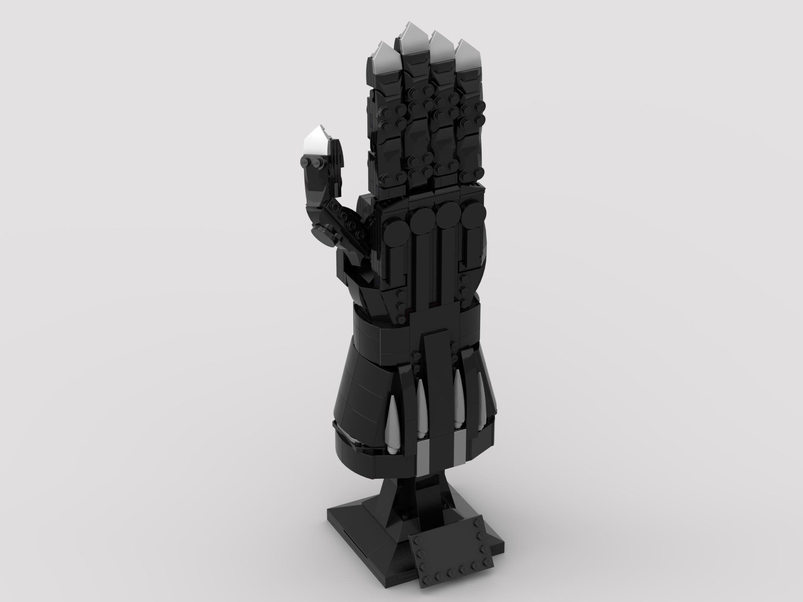

<figure class="alignleft">
	
</figure>
<figure class="alignleft">
	
</figure>

The reception to [Black Panther's Bust (76215)](https://brickset.com/sets/76215-1/Black-Panther){: target="_blank"} has been... [controversial](https://youtu.be/U2vZO2YJ0d0?t=142){: target="_blank"}, to say the least. Although I'm not a big fan of the bust itself (specially because of the scale), I really like the gauntlets. Moreover, I think one of them would fit perfectly side-by-side to the [Infinity Gauntlet](https://brickset.com/sets/76191-1/Infinity-Gauntlet){: target="_blank"}, the [Nano Gauntlet](https://brickset.com/sets/76223-1/Nano-Gauntlet){: target="_blank"}, and [Wolverine's Adamantium Claws](https://brickset.com/sets/76250-1/Wolverine-s-Adamantium-Claws){: target="_blank"}.

  

<!--more-->

This is why I have created these instructions. I combined the build of the right gauntlet with the "standard" gauntlet/helmet base of other similar sets. Moreover, I also swapped the color of some cheerful inner parts to black, so that they don't show that much (or at all) through the gaps.

## Instructions

I generated the instructions using [Bricklink Studio](https://www.bricklink.com/v3/studio/download.page){: target="_blank"}. You can find them here:

 

  

 

The instructions are pretty much a copy of those from set 76215. However, the interesting part is that they include an inventory (also part of the [Rebrickable page](https://rebrickable.com/mocs/MOC-156445/arturomoncadatorres/black-panther-gauntlet/#parts){: target="_blank"}), which should make your life easier if you want to buy the parts and build it yourself (like I plan on doing). The instructions are free to download. However, you can always [buy me a cookie](https://www.buymeacoffee.com/amoncadatorres){: target="_blank"} if you want to show some appreciation.

## Gallery
If you build this model, please share some pictures! I'd love to add them here.

----------
If you have any questions, comments, or feedback, leave them in the comments below or drop me a line on [Twitter (`@amoncadatorres`)](https://twitter.com/amoncadatorres){: target="_blank"} or on [Bluesky (`@amoncadatorres`)](https://bsky.app/profile/amoncadatorres.bsky.social){: target="_blank"}. Moreover, if you found this useful, fun, or just want to show your appreciation, you can always [buy me a cookie](https://www.buymeacoffee.com/amoncadatorres){: target="_blank"}. Cheers! 
