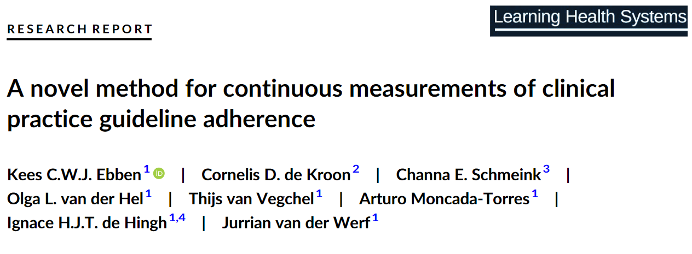

<figure class="alignleft">
	
</figure>

I am happy to share that our latest paper is out. In it, we present a method for measuring the adherence to guidelines in everyday clinical practice. This is a special work since it is the last (large) project to which I contributed during my time at [IKNL](https://iknl.nl/){:target="_blank"}

  

The abstract is as follows:

<!--more-->

> *Introduction*
Clinical practice guidelines (hereafter ‘guidelines’) are crucial in providing evidence-based recommendations for physicians and multidisciplinary teams to make informed decisions regarding diagnostics and treatment in various diseases, including cancer. While guideline implementation has been shown to reduce (unwanted) variability and improve outcome of care, monitoring of adherence to guidelines remains challenging. Real-world data collected from cancer registries can provide a continuous source for monitoring adherence levels. In this work, we describe a novel structured approach to guideline evaluation using real-world data that enables continuous monitoring. This method was applied to endometrial cancer patients in the Netherlands and implemented through a prototype web-based dashboard that enables interactive usage and supports various analyses.
>
> *Methods*
The guideline under study was parsed into clinical decision trees (CDTs) and an information standard was drawn up. A dataset from the Netherlands Cancer Registry (NCR) was used and data items from both instruments were mapped. By comparing guideline recommendations with real-world data an adherence classification was determined. The developed prototype can be used to identify and prioritize potential topics for guideline updates.
>
> *Results*
CDTs revealed 68 data items for recording in an information standard. Thirty-two data items from the NCR were mapped onto information standard data items. Four CDTs could sufficiently be populated with NCR data.
>
> *Conclusion*
The developed methodology can evaluate a guideline to identify potential improvements in recommendations and the success of the implementation strategy. In addition, it is able to identify patient and disease characteristics that influence decision-making in clinical practice. The method supports a cyclical process of developing, implementing and evaluating guidelines and can be scaled to other diseases and settings. It contributes to a learning healthcare cycle that integrates real-world data with external knowledge.

If you are interested, you can find the paper [here (Open Access)](https://onlinelibrary.wiley.com/doi/epdf/10.1002/lrh2.10384){:target="_blank"} (and its corresponding [BibTeX citation here](https://arturomoncadatorres.com/bibtex/ebben2023novel.txt){:target="_blank"}).

----------
If you have any comments, questions or feedback, leave them in the comments below or drop me a line on Twitter [(@amoncadatorres)](https://twitter.com/amoncadatorres).
