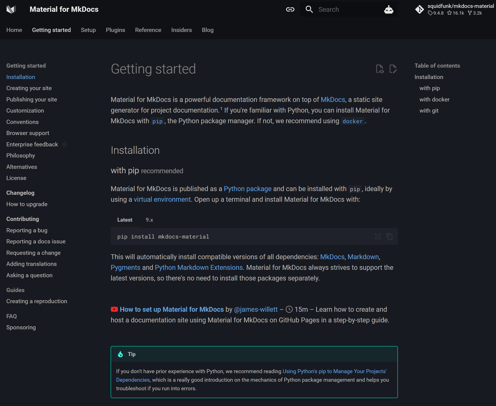

<figure class="alignleft">
	
</figure>

Recently, I was developing a package for my job. One of the requirements was to make
sure that it was properly documented. Being a big fan of Markdown, [`MkDocs`](https://www.mkdocs.org/){: target="_blank"}
was a natural choice. Not only is it easy to pick up and customize, but [Material for MkDocs](https://squidfunk.github.io/mkdocs-material/){: target="_blank"}
offers some fantastic functionality on top of it. With very little effort, you can add [admonitions](https://squidfunk.github.io/mkdocs-material/reference/admonitions/){: target="_blank"}
(the nice colorful boxes with handy information), [tables](https://squidfunk.github.io/mkdocs-material/reference/data-tables/){: target="_blank"} ,
[site search](https://squidfunk.github.io/mkdocs-material/setup/setting-up-site-search/?h=search){: target="_blank"} , and many others.

<figure class="aligncenter">
	
</figure>

After spending time and effort in writing the documentation *per se*, it was finally time to
go live and deploy it. You can do this manually using [GitHub Pages](https://squidfunk.github.io/mkdocs-material/publishing-your-site/#with-mkdocs){: target="_blank"}.
However, in my case it was much handier to automate the documentation deployment after every push.
GitHub Actions allow you to [do this very easily](https://squidfunk.github.io/mkdocs-material/publishing-your-site/#with-github-actions){: target="_blank"}.
Unfortunately, this solution didn't really work out of the box for me. In this post,
I will share the problems I ran into and how I fixed them. Maybe this will be useful for someone else.

<!--more-->

## 0. Package file structure
To understand the issues that I was having (and to see if you would run in the same ones),
let's see how the package was organized:

```
├── .github                <- Contains GitHub enhancements, including workflows for CI.
│
├── dissemination          <- Reports, presentations, posters, etc.
│
├── docs                   <- The most important part for this post.
│   ├── docs               <- The actual documentation files.
│   │   ├── api_reference
│   │   │   ├── index.md
│   │   │   ├── foo.md     
│   │   │   ├── bar.md  
│   │   │   └── ...
│   │   │
│   │   ├── stylesheets
│   │   │   └── extra.css  <- For further customization of the theme (https://squidfunk.github.io/mkdocs-material/customization/)
│   │   │
│   │   └── index.md       <- Index page of the documentation.
│   │
│   ├── site               <- Site files built for local hosting of the documentation (i.e., when using mkdocs serve)
│   └── mkdocs.yml         <- MkDocs configuration file
│
├── examples               <- Jupyter notebooks that serve as examples/tutorials.
│
├── cool_package           <- The actual scripts of cool_package.
│   ├── __init.py__
│   ├── foo.py
│   ├── bar.py
│   └── ..
│
├── multimedia             <- Multimedia files (e.g., logos).
│
├── .gitignore             <- Good old .gitignore.
│
├── LICENSE                <- It's always good to have a license for your package.
│
├── README.md              <- cool_package's README.
│
└── setup.py               <- Metadata of cool_project.
```


## 1. `Config file 'mkdocs.yml' does not exist`
This was the first error I ran into. This is because since the CI is being run from
the package's root directory, it cannot find the file `mkdocs.yml`, since it is one
level deeper (see the project structure above).

The solution was to [set a `working-directory` for a specific step](https://stackoverflow.com/a/58142276/948768){: target="_blank"}
by updating `ci.yml` as follows:



  name: ci
  on:
    push:
      branches:
        - master
        - main
  permissions:
    contents: write
  jobs:
    deploy:
      runs-on: ubuntu-latest
      steps:
        - uses: actions/checkout@v4
        - uses: actions/setup-python@v4
            with:
              python-version: 3.x
        - run: echo "cache_id=\$(date --utc '+%V')" >> \$GITHUB_ENV
        - uses: actions/cache@v3
            with:
              key: mkdocs-material-\${{ env.cache_id }}
              path: .cache
              restore-keys: |
                mkdocs-material-
        - run: pip install mkdocs-material
        - working-directory: ./docs
          run: mkdocs gh-deploy --force



As you can see, in line 25, we are telling GitHub actions "hey, execute this step starting
in `./docs`". This way, it can find `mkdocs.yml`.

## 2. `Config value 'plugins': The "XXX" plugin is not installed`
I ran into this issue with the `mkdocstrings` and `git-revision-date-localized` plugins.
This is because although you might have them installed in the local machine, they are
not in the environment that is created for deploying the documentation.

To fix it, update `ci.yml` as follows:


  name: ci
  on:
    push:
      branches:
        - master
        - main
  permissions:
    contents: write
  jobs:
    deploy:
      runs-on: ubuntu-latest
      steps:
        - uses: actions/checkout@v4
        - uses: actions/setup-python@v4
            with:
              python-version: 3.x
        - run: echo "cache_id=\$(date --utc '+%V')" >> \$GITHUB_ENV
        - uses: actions/cache@v3
            with:
              key: mkdocs-material-\${{ env.cache_id }}
              path: .cache
              restore-keys: |
                mkdocs-material-
        - run: pip install mkdocs-material
        - run: pip install mkdocstrings
        - run: pip3 install mkdocs-git-revision-date-localized-plugin
        - working-directory: ./docs
          run: mkdocs gh-deploy --force



In lines 25 and 26 we install the required plugins. You will have to do this
for any additional plugins that required you installing something in your
local machine.

## 3. `ModuleNotFoundError: No module named 'mkdocstrings_handlers'`
(Earlier in the log, you might also see `ERROR   -  Error reading page 'api_reference/foo.md': No module named 'mkdocstrings_handlers'`)

Wait, what? I just told it to install `mkdocstrings`! What's going on?

Well, this is a known [issue](https://github.com/mkdocstrings/mkdocstrings/issues/436){: target="_blank"} (or I should say "issue").
Since `MkDocs` is language agnostic, newer versions need a little bit more information when installing
`mkdocstrings`.

To solve this, you need to install [`mkdocstrings-python`](https://pypi.org/project/mkdocstrings-python/){: target="_blank"}
by updating `ci.yml` as follows:



  name: ci
  on:
    push:
      branches:
        - master
        - main
  permissions:
    contents: write
  jobs:
    deploy:
      runs-on: ubuntu-latest
      steps:
        - uses: actions/checkout@v4
        - uses: actions/setup-python@v4
            with:
              python-version: 3.x
        - run: echo "cache_id=\$(date --utc '+%V')" >> \$GITHUB_ENV
        - uses: actions/cache@v3
            with:
              key: mkdocs-material-\${{ env.cache_id }}
              path: .cache
              restore-keys: |
                mkdocs-material-
        - run: pip install mkdocs-material
        - run: pip install mkdocstrings[python]>=0.18
        - run: pip3 install mkdocs-git-revision-date-localized-plugin
        - working-directory: ./docs
          run: mkdocs gh-deploy --force



As you can see, in line 25 we are providing the proper dependency to
`mkdocstrings` by telling it to use the Python version.

## 4. `ERROR   -  mkdocstrings: No module named 'cool_package'`
You might have your package installed in your local machine, but it is not installed
in the created virtual environment.

To do so, just update `ci.yml` as follows:



  name: ci
  on:
    push:
      branches:
        - master
        - main
  permissions:
    contents: write
  jobs:
    deploy:
      runs-on: ubuntu-latest
      steps:
        - uses: actions/checkout@v4
        - uses: actions/setup-python@v4
            with:
              python-version: 3.x
        - run: echo "cache_id=\$(date --utc '+%V')" >> \$GITHUB_ENV
        - uses: actions/cache@v3
            with:
              key: mkdocs-material-${{ env.cache_id }}
              path: .cache
              restore-keys: |
                mkdocs-material-
        - run: pip install mkdocs-material
        - run: pip install mkdocstrings[python]>=0.18
        - run: pip3 install mkdocs-git-revision-date-localized-plugin
        - run: pip3 install --editable .
        - working-directory: ./docs
          run: mkdocs gh-deploy --force



As you can see in line 27, we are now telling it to install `cool_package`. Given my file structure
(see Sec. 0 above), `.` points to where `cool_package`'s, `setup.py` is located. Of course, if your
file organization is different, you might have to adapt this (probably using a trick similar to
the one showed in Sec. 1).

That's it! After this, I was able to easily update and deploy `cool_package`'s documentation website
after every push using GitHub Actions. I hope this posts helps you if you run into similar issues.

----------
If you have any comments, questions or feedback, leave them in the comments below [or drop me a line on Twitter (@amoncadatorres)](http://www.twitter.com/amoncadatorres){: target="_blank"}.
Moreover, if you found this useful, fun, or just want to show your appreciation, you can always [buy me a cookie](https://www.buymeacoffee.com/amoncadatorres){: target="_blank"}. Cheers!
