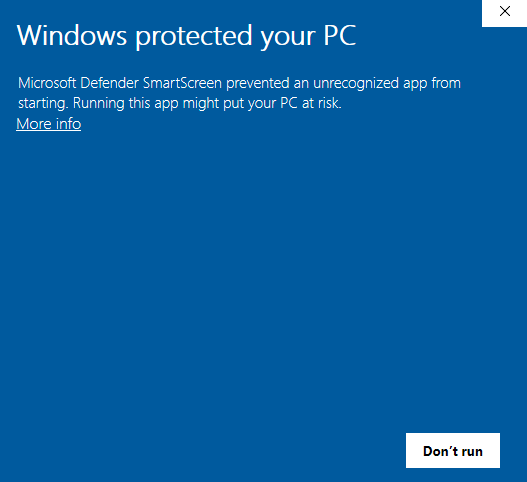

https://discourse.jabref.org/t/jabref-installation-windows-10-security-warning/2853/3
https://scoop.sh/#/


Need to have Git installed! Important
Need to have Git installed! Important

<figure class="alignleft">
	
</figure>

This week, I was setting up my new work computer (with Windows). As part of it, I wanted to install my favorite reference manager: [`JabRef`](https://www.jabref.org/){: target="_blank"}. 
Unfortunately, the [normal installation](https://docs.jabref.org/installation){: target="_blank"} (i.e., [downloading the `.msi` file](https://downloads.jabref.org/){: target="_blank"})
didn't work, since Windows Protection was blocking it:

<figure class="aligncenter">
	
</figure>

I found this weird since I did have admin rights to install stuff. After digging around, I learned that this is because the installer needs to have an electronic certificate.
Sadly, this is very expensive, which is a big problem for (Open Source) projects like JabRef which depend mostly on donations. However, there are alternatives. In this post
I would like to share a few of them and which one worked for me. Hopefully this will save you a headache.

<!--more-->

## 1. Use the portable version
Portable versions can be a great alternative to a conventional installation. Actually, JabRef has a [portable version](https://docs.jabref.org/installation#portable-version){: target="_blank"} of its own. 
Just download the version corresponding to your operating system, extract the files... and that's pretty much it. You can even run JabRef (or any other portable app) from a USB drive (if you still have one). 
Unfortunately, in my case this didn't work either, so on to Option 2.


## 2. Install using a package manager
JabRef suggests using the [chocolatey package manager](https://chocolatey.org/){: target="_blank"}. However, in my case, I used [Scoop](https://scoop.sh/){: target="_blank"}.
Just follow the following steps.

2.0 First of all, make sure that you have [Git installed in your machine](https://git-scm.com/download/win){: target="_blank"}.

2.1 Install Scoop by opening a Windows PowerShell terminal, going to `C:\`, and running each of the following lines individually:

```
Set-ExecutionPolicy -ExecutionPolicy RemoteSigned -Scope CurrentUser
```

```
Invoke-RestMethod -Uri https://get.scoop.sh | Invoke-Expression
```

2.2 Now we can install JabRef with the following [commands](https://scoop.sh/#/apps?q=jabref&s=0&d=1&o=true){: target="_blank"}:

```
scoop bucket add extras
```

```
scoop install jabref
```

That's it! You can use a similar procedure with other programs that Windows blocks. Nevertheless, **be extra careful with the software that you install in your machine**!
Make sure that it always comes from a trusted sourced. Windows blocks these installations because of a reason. I trust JabRef because I have used it 
for a long time and it comes from a reliable source. However, more often than not, this is not the case. 

----------
If you have any comments, questions or feedback, leave them in the comments below [or drop me a line on Twitter (@amoncadatorres)](http://www.twitter.com/amoncadatorres){: target="_blank"}.
Moreover, if you found this useful, fun, or just want to show your appreciation, you can always [buy me a cookie](https://www.buymeacoffee.com/amoncadatorres){: target="_blank"}. Cheers!
